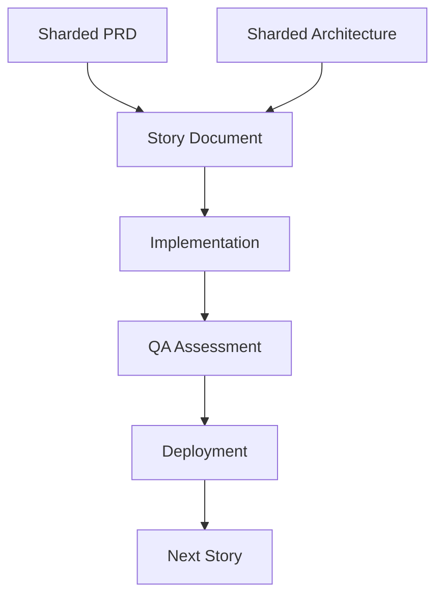

# CLAUDE.md - Receipt Organizer MVP

This file provides comprehensive guidance to Claude Code (claude.ai/code) when working with this repository, documenting the complete project state, contextual relationships, and development patterns.

## 🏗️ PROJECT STATE OVERVIEW

**Current Phase**: Active Development (Production Code)
**Development Stage**: Epic 3 Complete, Epic 4 Ready
**Documentation**: Complete (Sharded PRD & Architecture)
**Codebase**: Flutter Mobile App + Next.js API

### Contextual Project Hierarchy

```
Receipt Organizer MVP
├── 📋 Planning Layer (Complete)
│   ├── Sharded PRD (12 sections)
│   ├── Sharded Architecture (11 sections)
│   └── Front-end Specification
├── 🚀 Implementation Layer (Active)
│   ├── Flutter Mobile App (apps/mobile)
│   ├── Next.js API (apps/api)
│   └── 13+ Implemented Stories
└── 🔄 Integration Layer
    ├── QuickBooks OAuth (Implemented)
    ├── Xero OAuth (Implemented)
    └── CSV Export Pipeline (Complete)
```

## 📚 DOCUMENTATION ARCHITECTURE

### Primary Documentation Sources (Hierarchical Order)

1. **Sharded PRD** (`docs/sharded-prd/`)
   - **Purpose**: Product requirements and user stories
   - **Format**: POML (Product Object Markup Language)
   - **Key Files**:
     - `index.poml` - Document navigation and structure
     - `epics.poml` - All epic definitions and user stories
     - `requirements.poml` - Functional/non-functional requirements
     - `user-personas.poml` - Sarah, Mike, Linda personas
     - `acceptance-criteria.poml` - Success metrics
   - **Relationship**: Drives all story creation and implementation

2. **Sharded Architecture** (`docs/sharded-architecture/`)
   - **Purpose**: Technical implementation specifications
   - **Format**: Markdown with POML metadata
   - **Key Files**:
     - `index.md` - Architecture overview and navigation
     - `tech-stack.md` - Technology decisions and rationale
     - `api-specification.md` - RESTful API contracts
     - `database-schema.md` - SQLite schema definitions
     - `frontend-architecture.md` - Flutter app structure
     - `coding-standards.md` - Development conventions
   - **Relationship**: Implements PRD requirements technically

3. **Story Documents** (`docs/stories/`)
   - **Purpose**: Granular implementation tasks
   - **Format**: Markdown with structured metadata
   - **Naming**: `{epic}.{story}.story.md` (e.g., 3.13.story.md)
   - **Status Tracking**: Draft → Review → Done/Complete
   - **Relationship**: Derived from PRD epics, implements architecture

4. **QA Assessments** (`docs/qa/assessments/`)
   - **Purpose**: Quality assurance and validation
   - **Format**: Risk assessments, test designs, traces
   - **Naming**: `{story}-{type}-{date}.md`
   - **Relationship**: Validates story implementations

## 🏛️ SYSTEM ARCHITECTURE

### Technology Stack (Implemented)

```yaml
Frontend:
  Framework: Flutter 3.24+
  State_Management: Riverpod 2.4+
  UI_Components: Material Design 3
  Platform_Support: iOS 12+, Android API 21+

Backend:
  API_Framework: Next.js 15.5.2
  Runtime: Node.js with Vercel Edge
  Authentication: Jose (JWT)
  Rate_Limiting: Upstash Redis
  Deployment: Vercel (Production)

OCR_Processing:
  Primary: Google ML Kit (on-device)
  Fallback: TensorFlow Lite
  Accuracy_Target: 89-92%
  Processing_Time: <5s p95

Data_Layer:
  Local_Database: SQLite via sqflite
  State_Persistence: Hive for settings
  Image_Storage: Local filesystem
  Export_Format: CSV (RFC 4180)

Integration:
  QuickBooks: OAuth 2.0 + REST API
  Xero: OAuth 2.0 + REST API
  CSV_Templates: Platform-specific formatting
```

### Contextual Code Organization

```
apps/
├── mobile/                    # Flutter Application
│   ├── lib/
│   │   ├── core/             # Foundation layer
│   │   │   ├── models/       # Data models (Receipt, AuditLog)
│   │   │   ├── services/     # Core services (Auth, Network)
│   │   │   └── config/       # Environment configuration
│   │   ├── domain/           # Business logic layer
│   │   │   ├── services/     # OCR, CSV, Image processing
│   │   │   └── interfaces/   # Service contracts
│   │   ├── features/         # Feature modules
│   │   │   ├── capture/      # Photo capture & OCR
│   │   │   ├── receipts/     # Receipt management
│   │   │   ├── export/       # CSV export & validation
│   │   │   └── settings/     # App configuration
│   │   └── infrastructure/   # External integrations
│   └── test/                 # Comprehensive test suite
│
└── api/                      # Next.js API
    ├── app/
    │   ├── api/
    │   │   ├── oauth/        # OAuth endpoints
    │   │   ├── validate/     # CSV validation
    │   │   └── export/       # Export endpoints
    │   └── lib/              # Shared utilities
    └── middleware.ts         # Security & rate limiting
```

## 📊 IMPLEMENTATION STATUS

### Epic Completion Matrix

| Epic | Name | Stories | Status | Key Features |
|------|------|---------|--------|--------------|
| **1** | Capture & Extract | 1.1-1.4 | ✅ 75% Complete | Batch capture, Edge detection, OCR confidence, Retry mechanism |
| **2** | Review & Correct | 2.1-2.4 | ✅ 100% Complete | Inline editing, Merchant normalization, Zoom/pan, Quick actions |
| **3** | Export & Integrate | 3.9-3.13 | ✅ 100% Complete | CSV validation, QuickBooks/Xero, Date ranges, Bulk delete |
| **4** | Settings & Support | 4.1-4.4 | 🔄 Ready to Start | Storage management, Export preferences, Confidence thresholds |

### Story Implementation Tracker

```
Epic 1 - Capture & Extract:
├── 1.1: Batch Capture         [Ready for Done]
├── 1.2: Auto Edge Detection   [Complete]
├── 1.3: OCR Confidence        [In Progress]
└── 1.4: Retry Failed Capture  [Ready]

Epic 2 - Review & Correct:
├── 2.1: Inline Field Editing  [Complete]
├── 2.2: Merchant Normalization [Complete]
├── 2.3: Zoom and Pan          [Complete]
└── 2.4: Quick Actions         [Complete]

Epic 3 - Export & Integrate:
├── 3.9: CSV Validation        [Complete]
├── 3.10: CSV Format Options   [Approved]
├── 3.11: Date Range Export    [Complete]
├── 3.12: OAuth Integration    [Complete - PR Merged]
└── 3.13: Bulk Delete          [✅ COMPLETE - 2025-09-10]
```

## 🔄 DEVELOPMENT WORKFLOW

### Story Development Lifecycle

1. **Story Creation** (Scrum Master)
   - Source: `docs/sharded-prd/epics.poml`
   - Output: `docs/stories/{epic}.{story}.story.md`
   - Status: Draft → Review → Done

2. **Implementation** (Developer)
   - Reference: Story document + Architecture
   - Code Location: `apps/mobile/lib/features/`
   - Testing: Unit + Integration + Widget tests

3. **QA Validation** (QA Engineer)
   - Creates: Risk assessment, Test design
   - Location: `docs/qa/assessments/`
   - Updates: Story status to Done

4. **Deployment** (DevOps)
   - Mobile: Build APK/IPA for testing
   - API: Deploy to Vercel
   - Validation: End-to-end testing

### Contextual Dependencies



## 🛠️ DEVELOPMENT COMMANDS

### Flutter Mobile App
```bash
# Development
cd apps/mobile
flutter pub get                    # Install dependencies
flutter run                        # Run on connected device
flutter test                       # Run all tests
flutter build apk --debug          # Build debug APK
flutter analyze                    # Static analysis

# Code Generation (Freezed models)
dart run build_runner build --delete-conflicting-outputs
```

### Next.js API
```bash
# Development
cd apps/api
npm install                        # Install dependencies
npm run dev                        # Start dev server (port 3001)
npm run build                      # Production build
npm test                          # Run OAuth tests

# Deployment
./deploy.sh                        # Deploy to Vercel
./add-env-vars.sh                 # Configure environment
```

## 📋 KEY PRINCIPLES & PATTERNS

### Architectural Principles
1. **Offline-First**: All core functionality works without network
2. **Progressive Enhancement**: Network features enhance, not require
3. **Confidence-Based UX**: Show OCR confidence, enable quick edits
4. **Fail-Safe Exports**: Validate CSV before export, provide previews
5. **Privacy-First**: No cloud storage, local processing only

### Code Patterns
- **Repository Pattern**: Data access abstraction
- **Provider Pattern**: State management via Riverpod
- **Service Layer**: Business logic isolation
- **Feature Modules**: Vertical slice architecture
- **Freezed Models**: Immutable data classes

### Testing Strategy
- **Unit Tests**: Services, repositories, utilities
- **Widget Tests**: UI components and screens
- **Integration Tests**: Feature workflows
- **E2E Tests**: Critical user journeys

## 🚀 NEXT STEPS

### Immediate Priorities
1. **Epic 4 Implementation**: Settings & Support features
2. **Performance Optimization**: Image processing pipeline
3. **Production Deployment**: App store submissions

### Development Entry Points
- **New Feature**: Start with story in `docs/stories/`
- **Bug Fix**: Check QA assessments for known issues
- **Refactoring**: Follow architecture guidelines
- **Testing**: Refer to existing test patterns

## 📖 REFERENCE DOCUMENTS

### Essential Reading Order
1. `docs/sharded-architecture/index.md` - System overview
2. `docs/sharded-prd/epics.poml` - Feature requirements
3. `docs/stories/3.13.story.md` - Latest completed story (example)
4. `docs/qa/assessments/` - Quality standards

### Research & Analysis
- `COMPREHENSIVE_FEASIBLE_TECH_STACK_RECOMMENDATION_2025.md` - Tech decisions
- `analysis/EVIDENCE_BACKED_REQUIREMENTS.md` - Validated requirements
- `analysis/CSV_COMPATIBILITY_ANALYSIS.md` - Export specifications

## ⚠️ IMPORTANT NOTES

1. **This is NOT a planning phase project** - Active production code exists
2. **Use sharded documents** - PRD and Architecture are split into sections
3. **Follow BMad methodology** - Story-driven development with QA gates
4. **Maintain offline-first** - Network is enhancement, not requirement
5. **Update this file** - Keep CLAUDE.md current with project state

---
*Last Updated: 2025-01-10*
*Next Review: After Epic 4 completion*