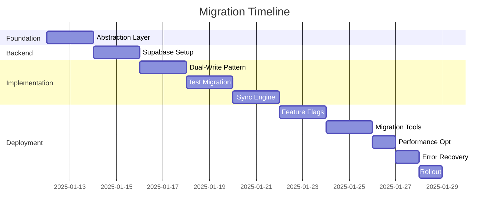

# Migration Plan: Offline-First to Hybrid Cloud
<!-- @poml:meta
  type: "migration-plan"
  version: "1.0.0"
  created: "2025-01-11"
  duration: "17 days"
  risk: "medium"
-->

## Executive Summary
<!-- @poml:summary
  from: "Offline-first with SQLite"
  to: "Hybrid cloud with Supabase"
  reason: "131 test failures, path_provider issues, mobile app requirements"
  approach: "Phased migration with rollback capability"
-->

This plan outlines the systematic migration from offline-first architecture to hybrid cloud, addressing 131 failing tests caused by file system dependencies while maintaining offline capabilities and adding cloud synchronization.

## Migration Timeline
<!-- @poml:timeline
  start: "Day 1"
  end: "Day 17"
  phases: 10
  checkpoints: "After each phase"
-->



## Phase 1: Foundation Layer (Days 1-2)
<!-- @poml:phase:1
  name: "Abstraction and Interfaces"
  duration: "2 days"
  risk: "low"
  rollback: "Not needed - additive only"
-->

### Objectives
- Create repository interfaces for data access abstraction
- Implement mock services for testing without file system
- Fix initial test failures

### Tasks
```yaml
Day 1:
  Morning:
    - Create IReceiptRepository interface
    - Create IImageStorageService interface
    - Create IAuthService interface
  Afternoon:
    - Implement MockReceiptRepository
    - Implement MockImageStorageService
    - Implement MockAuthService
    
Day 2:
  Morning:
    - Update all providers to use interfaces
    - Create TestProviderScope with mocks
  Afternoon:
    - Run tests and fix failures
    - Document interface contracts
```

### Deliverables
- [ ] Repository interfaces created
- [ ] Mock implementations complete
- [ ] 50+ tests passing with mocks

### Code Implementation
```dart
// interfaces/i_receipt_repository.dart
abstract class IReceiptRepository {
  Future<List<Receipt>> getAllReceipts();
  Future<Receipt?> getReceiptById(String id);
  Future<Receipt> createReceipt(Receipt receipt);
  Future<void> updateReceipt(Receipt receipt);
  Future<void> deleteReceipt(String id);
}

// mocks/mock_receipt_repository.dart
class MockReceiptRepository implements IReceiptRepository {
  final List<Receipt> _receipts = [];
  
  @override
  Future<List<Receipt>> getAllReceipts() async {
    await Future.delayed(Duration(milliseconds: 10));
    return List.from(_receipts);
  }
}
```

## Phase 2: Supabase Integration (Days 3-4)
<!-- @poml:phase:2
  name: "Cloud Backend Setup"
  duration: "2 days"
  risk: "low"
  dependencies: ["Supabase account", "API keys"]
-->

### Objectives
- Set up Supabase project and database schema
- Configure authentication and storage
- Implement cloud repository

### Tasks
```yaml
Day 3:
  Morning:
    - Create Supabase project
    - Design database schema
    - Set up Row Level Security
  Afternoon:
    - Configure Storage buckets
    - Set up Auth providers
    - Generate TypeScript types
    
Day 4:
  Morning:
    - Implement CloudReceiptRepository
    - Implement CloudImageStorage
  Afternoon:
    - Test cloud operations
    - Set up Realtime subscriptions
```

### Database Schema
```sql
-- receipts table
CREATE TABLE receipts (
  id UUID PRIMARY KEY DEFAULT uuid_generate_v4(),
  user_id UUID REFERENCES auth.users(id) ON DELETE CASCADE,
  merchant_name TEXT,
  receipt_date DATE,
  total_amount DECIMAL(10,2),
  tax_amount DECIMAL(10,2),
  category TEXT,
  payment_method TEXT,
  notes TEXT,
  image_url TEXT,
  thumbnail_url TEXT,
  ocr_confidence FLOAT,
  sync_version INTEGER DEFAULT 1,
  created_at TIMESTAMPTZ DEFAULT NOW(),
  updated_at TIMESTAMPTZ DEFAULT NOW(),
  deleted_at TIMESTAMPTZ
);

-- indexes
CREATE INDEX idx_user_receipts ON receipts(user_id, created_at DESC);
CREATE INDEX idx_receipt_date ON receipts(receipt_date);
CREATE INDEX idx_sync_status ON receipts(sync_version, updated_at);

-- RLS policies
ALTER TABLE receipts ENABLE ROW LEVEL SECURITY;

CREATE POLICY "Users can view own receipts"
  ON receipts FOR SELECT
  USING (auth.uid() = user_id);

CREATE POLICY "Users can create own receipts"
  ON receipts FOR INSERT
  WITH CHECK (auth.uid() = user_id);

CREATE POLICY "Users can update own receipts"
  ON receipts FOR UPDATE
  USING (auth.uid() = user_id);

CREATE POLICY "Users can delete own receipts"
  ON receipts FOR DELETE
  USING (auth.uid() = user_id);
```

### Deliverables
- [ ] Supabase project configured
- [ ] Database schema deployed
- [ ] CloudReceiptRepository implemented
- [ ] Authentication working

## Phase 3: Dual-Write Implementation (Days 5-6)
<!-- @poml:phase:3
  name: "Parallel Persistence"
  duration: "2 days"
  risk: "medium"
  rollback: "Disable cloud writes via feature flag"
-->

### Objectives
- Implement dual-write pattern (local + cloud)
- Ensure data consistency
- Add operation queuing

### Tasks
```yaml
Day 5:
  Morning:
    - Create HybridRepository wrapper
    - Implement dual-write logic
  Afternoon:
    - Add sync queue for failed writes
    - Implement retry mechanism
    
Day 6:
  Morning:
    - Test dual-write operations
    - Verify data consistency
  Afternoon:
    - Add metrics and logging
    - Document failure scenarios
```

### Implementation
```dart
class HybridReceiptRepository implements IReceiptRepository {
  final LocalReceiptRepository _local;
  final CloudReceiptRepository _cloud;
  final SyncQueueService _syncQueue;
  
  @override
  Future<Receipt> createReceipt(Receipt receipt) async {
    // Always write to local first (fast, reliable)
    final localReceipt = await _local.createReceipt(receipt);
    
    // Attempt cloud write (async, may fail)
    try {
      await _cloud.createReceipt(receipt);
    } catch (e) {
      // Queue for later sync if cloud write fails
      _syncQueue.enqueue(
        SyncOperation(
          type: OperationType.create,
          data: receipt.toJson(),
          retryCount: 0,
        ),
      );
    }
    
    return localReceipt;
  }
}
```

### Deliverables
- [ ] Dual-write pattern implemented
- [ ] Sync queue operational
- [ ] Consistency verified

## Phase 4: Test Migration (Days 7-8)
<!-- @poml:phase:4
  name: "Fix Failing Tests"
  duration: "2 days"
  risk: "low"
  target: "100% test passage"
-->

### Objectives
- Migrate all tests to use mock services
- Fix remaining 131 failing tests
- Achieve 100% test passage

### Tasks
```yaml
Day 7:
  Morning:
    - Update widget tests with mocks
    - Fix preview screen tests
  Afternoon:
    - Fix capture flow tests
    - Fix export tests
    
Day 8:
  Morning:
    - Fix integration tests
    - Update test helpers
  Afternoon:
    - Run full test suite
    - Document test patterns
```

### Test Patterns
```dart
// Before (FAILS)
testWidgets('saves captured image', (tester) async {
  final service = ImageStorageService();
  final path = await service.saveTemporary(imageData);
  expect(File(path).existsSync(), isTrue); // MissingPluginException!
});

// After (PASSES)
testWidgets('saves captured image', (tester) async {
  await tester.pumpWidget(
    TestProviderScope(
      overrides: [
        imageStorageServiceProvider.overrideWithValue(
          MockImageStorageService(),
        ),
      ],
      child: CaptureScreen(),
    ),
  );
  
  // Test without file system
  await tester.tap(find.byIcon(Icons.camera));
  await tester.pumpAndSettle();
  
  expect(find.byType(PreviewScreen), findsOneWidget);
});
```

### Deliverables
- [ ] All 571 tests passing
- [ ] Test documentation updated
- [ ] CI/CD pipeline green

## Phase 5: Sync Engine (Days 9-10)
<!-- @poml:phase:5
  name: "Bidirectional Synchronization"
  duration: "2 days"
  risk: "high"
  complexity: "Conflict resolution, eventual consistency"
-->

### Objectives
- Implement bidirectional sync
- Handle conflict resolution
- Ensure eventual consistency

### Tasks
```yaml
Day 9:
  Morning:
    - Design sync protocol
    - Implement sync engine core
  Afternoon:
    - Add conflict resolution
    - Implement version tracking
    
Day 10:
  Morning:
    - Test sync scenarios
    - Handle edge cases
  Afternoon:
    - Add sync monitoring
    - Performance optimization
```

### Sync Implementation
```dart
class SyncEngine {
  static const Duration syncInterval = Duration(minutes: 5);
  
  Stream<SyncStatus> performSync() async* {
    yield SyncStatus.starting();
    
    // 1. Check connectivity
    if (!await _connectivity.isOnline()) {
      yield SyncStatus.offline();
      return;
    }
    
    // 2. Pull remote changes
    yield SyncStatus.pulling();
    final remoteChanges = await _pullRemoteChanges();
    
    // 3. Resolve conflicts
    yield SyncStatus.resolving();
    final resolved = await _resolveConflicts(remoteChanges);
    
    // 4. Apply remote changes locally
    await _applyRemoteChanges(resolved);
    
    // 5. Push local changes
    yield SyncStatus.pushing();
    final localChanges = await _getLocalChanges();
    await _pushLocalChanges(localChanges);
    
    // 6. Complete
    yield SyncStatus.complete(
      pulled: remoteChanges.length,
      pushed: localChanges.length,
    );
  }
  
  Future<List<ConflictResolution>> _resolveConflicts(
    List<Receipt> remoteChanges,
  ) async {
    final resolutions = <ConflictResolution>[];
    
    for (final remote in remoteChanges) {
      final local = await _local.getReceiptById(remote.id);
      
      if (local != null && local.syncVersion != remote.syncVersion) {
        // Conflict detected
        final resolution = _resolveConflict(local, remote);
        resolutions.add(resolution);
      }
    }
    
    return resolutions;
  }
  
  ConflictResolution _resolveConflict(Receipt local, Receipt remote) {
    // Last-write-wins with version increment
    if (remote.updatedAt.isAfter(local.updatedAt)) {
      return ConflictResolution.useRemote(remote);
    } else {
      return ConflictResolution.useLocal(local);
    }
  }
}
```

### Deliverables
- [ ] Sync engine operational
- [ ] Conflict resolution tested
- [ ] Performance targets met

## Phase 6: Feature Flags (Days 11-12)
<!-- @poml:phase:6
  name: "Controlled Rollout"
  duration: "2 days"
  risk: "low"
  purpose: "Enable gradual migration"
-->

### Objectives
- Implement feature flag system
- Configure gradual rollout
- Enable instant rollback

### Tasks
```yaml
Day 11:
  Morning:
    - Implement feature flag service
    - Add remote configuration
  Afternoon:
    - Wire flags to features
    - Test flag toggles
    
Day 12:
  Morning:
    - Configure rollout percentages
    - Set up monitoring
  Afternoon:
    - Test rollback scenarios
    - Document flag usage
```

### Feature Flag Implementation
```dart
class FeatureFlags {
  static const String cloudSyncEnabled = 'cloud_sync_enabled';
  static const String dualWriteEnabled = 'dual_write_enabled';
  static const String realtimeEnabled = 'realtime_enabled';
  
  final RemoteConfig _remoteConfig;
  final SharedPreferences _localPrefs;
  
  bool isEnabled(String flag) {
    // Check remote config first
    if (_remoteConfig.hasValue(flag)) {
      return _remoteConfig.getBool(flag);
    }
    
    // Fall back to local preference
    return _localPrefs.getBool(flag) ?? _getDefaultValue(flag);
  }
  
  Future<void> enableForUser(String flag, String userId) async {
    // Enable for specific user (canary testing)
    await _remoteConfig.setUserProperty(userId, flag, 'true');
  }
  
  Future<void> rollout(String flag, double percentage) async {
    // Gradual rollout to percentage of users
    await _remoteConfig.setRolloutPercentage(flag, percentage);
  }
}
```

### Deliverables
- [ ] Feature flag system implemented
- [ ] Remote configuration working
- [ ] Rollback tested

## Phase 7: Migration Tools (Days 13-14)
<!-- @poml:phase:7
  name: "Data Migration Utilities"
  duration: "2 days"
  risk: "medium"
  validation: "Checksums and verification"
-->

### Objectives
- Build data migration tools
- Validate data integrity
- Create rollback procedures

### Tasks
```yaml
Day 13:
  Morning:
    - Build export tool for SQLite
    - Create import tool for Supabase
  Afternoon:
    - Add data validation
    - Implement checksums
    
Day 14:
  Morning:
    - Test migration scenarios
    - Verify data integrity
  Afternoon:
    - Create rollback tools
    - Document procedures
```

### Migration Tools
```dart
class DataMigrator {
  Future<MigrationReport> migrateToCloud() async {
    final report = MigrationReport();
    
    // 1. Export local data
    report.startPhase('export');
    final localReceipts = await _local.getAllReceipts();
    report.exported = localReceipts.length;
    
    // 2. Validate data
    report.startPhase('validation');
    final validation = await _validateData(localReceipts);
    if (!validation.isValid) {
      return report.failed(validation.errors);
    }
    
    // 3. Upload to cloud
    report.startPhase('upload');
    int uploaded = 0;
    
    for (final batch in _batchReceipts(localReceipts, 100)) {
      try {
        await _cloud.createBatch(batch);
        uploaded += batch.length;
        report.progress = uploaded / localReceipts.length;
      } catch (e) {
        report.addError('Batch upload failed: $e');
      }
    }
    
    // 4. Verify migration
    report.startPhase('verification');
    final cloudCount = await _cloud.getReceiptCount();
    
    if (cloudCount != localReceipts.length) {
      report.addWarning(
        'Count mismatch: local=$localReceipts.length, cloud=$cloudCount'
      );
    }
    
    return report.complete();
  }
}
```

### Deliverables
- [ ] Migration tools built
- [ ] Data validation working
- [ ] Rollback procedures tested

## Phase 8: Performance Optimization (Day 15)
<!-- @poml:phase:8
  name: "Performance Tuning"
  duration: "1 day"
  risk: "low"
  targets: ["< 200ms API response", "< 5s sync time"]
-->

### Objectives
- Optimize query performance
- Implement caching strategies
- Reduce sync latency

### Tasks
```yaml
Day 15:
  Morning:
    - Profile performance bottlenecks
    - Optimize database queries
    - Implement caching layer
  Afternoon:
    - Test performance improvements
    - Document optimization strategies
```

### Optimization Implementation
```dart
class PerformanceOptimizer {
  // Query optimization
  Future<List<Receipt>> getReceiptsOptimized({
    required int limit,
    required int offset,
  }) async {
    // Use indexed query with pagination
    return await _db.rawQuery('''
      SELECT * FROM receipts 
      WHERE user_id = ? 
      ORDER BY created_at DESC 
      LIMIT ? OFFSET ?
    ''', [userId, limit, offset]);
  }
  
  // Caching layer
  final _cache = MemoryCache<String, dynamic>(
    maxSize: 100,
    ttl: Duration(minutes: 5),
  );
  
  Future<T> withCache<T>(
    String key,
    Future<T> Function() fetch,
  ) async {
    // Check cache first
    final cached = _cache.get(key);
    if (cached != null) return cached as T;
    
    // Fetch and cache
    final result = await fetch();
    _cache.set(key, result);
    return result;
  }
  
  // Batch operations
  Future<void> syncBatch(List<Receipt> receipts) async {
    // Process in parallel batches
    final futures = <Future>[];
    
    for (final batch in _batchReceipts(receipts, 10)) {
      futures.add(_syncBatchParallel(batch));
    }
    
    await Future.wait(futures);
  }
}
```

### Deliverables
- [ ] Performance targets met
- [ ] Caching implemented
- [ ] Monitoring in place

## Phase 9: Error Recovery (Day 16)
<!-- @poml:phase:9
  name: "Resilience and Recovery"
  duration: "1 day"
  risk: "low"
  patterns: ["Circuit breaker", "Exponential backoff", "Dead letter queue"]
-->

### Objectives
- Implement error recovery mechanisms
- Add circuit breakers
- Create dead letter queue

### Tasks
```yaml
Day 16:
  Morning:
    - Implement retry logic
    - Add circuit breakers
    - Create dead letter queue
  Afternoon:
    - Test failure scenarios
    - Document recovery procedures
```

### Error Recovery Implementation
```dart
class ErrorRecovery {
  // Exponential backoff retry
  Future<T> withRetry<T>(
    Future<T> Function() operation, {
    int maxAttempts = 3,
    Duration initialDelay = const Duration(seconds: 1),
  }) async {
    int attempt = 0;
    Duration delay = initialDelay;
    
    while (attempt < maxAttempts) {
      try {
        return await operation();
      } catch (e) {
        attempt++;
        
        if (attempt >= maxAttempts) {
          // Move to dead letter queue
          await _deadLetterQueue.add(
            FailedOperation(
              operation: operation.toString(),
              error: e.toString(),
              attempts: attempt,
            ),
          );
          rethrow;
        }
        
        // Exponential backoff
        await Future.delayed(delay);
        delay *= 2;
      }
    }
    
    throw Exception('Should not reach here');
  }
  
  // Circuit breaker
  final _circuitBreaker = CircuitBreaker(
    failureThreshold: 5,
    recoveryTime: Duration(minutes: 1),
  );
  
  Future<T> withCircuitBreaker<T>(
    String operation,
    Future<T> Function() action,
  ) async {
    if (_circuitBreaker.isOpen(operation)) {
      throw CircuitBreakerOpenException(operation);
    }
    
    try {
      final result = await action();
      _circuitBreaker.recordSuccess(operation);
      return result;
    } catch (e) {
      _circuitBreaker.recordFailure(operation);
      rethrow;
    }
  }
}
```

### Deliverables
- [ ] Retry logic implemented
- [ ] Circuit breakers operational
- [ ] Dead letter queue working

## Phase 10: Production Rollout (Day 17)
<!-- @poml:phase:10
  name: "Deployment and Monitoring"
  duration: "1 day"
  risk: "medium"
  strategy: "Canary deployment"
-->

### Objectives
- Deploy to production
- Monitor key metrics
- Validate success criteria

### Tasks
```yaml
Day 17:
  Morning:
    - Deploy API to Vercel
    - Enable feature flags (5% users)
    - Monitor initial metrics
  Afternoon:
    - Gradual rollout (25%, 50%, 100%)
    - Validate success metrics
    - Document lessons learned
```

### Rollout Strategy
```yaml
Canary Deployment:
  Stage 1 (5% users):
    - Duration: 2 hours
    - Monitor: Error rates, sync success
    - Rollback trigger: Error rate > 1%
    
  Stage 2 (25% users):
    - Duration: 4 hours
    - Monitor: Performance metrics
    - Rollback trigger: p95 latency > 500ms
    
  Stage 3 (50% users):
    - Duration: 12 hours
    - Monitor: User feedback
    - Rollback trigger: Support tickets > 5
    
  Stage 4 (100% users):
    - Duration: Permanent
    - Monitor: All metrics
    - Success criteria: All KPIs met
```

### Monitoring Dashboard
```dart
class ProductionMonitor {
  Stream<Metrics> streamMetrics() async* {
    while (true) {
      final metrics = Metrics(
        errorRate: await _getErrorRate(),
        syncSuccessRate: await _getSyncSuccessRate(),
        p95Latency: await _getP95Latency(),
        activeUsers: await _getActiveUsers(),
        supportTickets: await _getSupportTickets(),
      );
      
      yield metrics;
      
      // Check rollback triggers
      if (metrics.errorRate > 0.01) {
        await _triggerRollback('High error rate: ${metrics.errorRate}');
      }
      
      await Future.delayed(Duration(minutes: 1));
    }
  }
}
```

### Deliverables
- [ ] Production deployment complete
- [ ] Metrics within targets
- [ ] Rollback plan tested

## Risk Mitigation
<!-- @poml:risks
  assessment: "Medium overall risk"
  mitigation: "Feature flags, rollback procedures, monitoring"
-->

### Identified Risks

| Risk | Probability | Impact | Mitigation |
|------|------------|--------|------------|
| Data loss during migration | Low | High | Backups, checksums, validation |
| Sync conflicts | Medium | Medium | Conflict resolution, versioning |
| Performance degradation | Low | High | Caching, monitoring, rollback |
| Test failures | Low | Medium | Mock services, gradual migration |
| User disruption | Low | High | Feature flags, canary deployment |

### Rollback Procedures
```dart
class RollbackManager {
  Future<void> executeRollback(String reason) async {
    // 1. Disable feature flags
    await _featureFlags.disableAll([
      'cloud_sync_enabled',
      'dual_write_enabled',
      'realtime_enabled',
    ]);
    
    // 2. Switch to local-only mode
    await _setRepositoryMode(RepositoryMode.localOnly);
    
    // 3. Stop sync engine
    await _syncEngine.stop();
    
    // 4. Notify team
    await _notifications.alert(
      'Rollback executed: $reason',
      severity: AlertSeverity.high,
    );
    
    // 5. Log incident
    await _incidentLog.create(
      IncidentReport(
        type: 'rollback',
        reason: reason,
        timestamp: DateTime.now(),
        metrics: await _captureMetrics(),
      ),
    );
  }
}
```

## Success Criteria
<!-- @poml:success
  technical: "All tests passing, performance targets met"
  business: "No user disruption, feature adoption > 80%"
  operational: "Zero downtime, < 5 min rollback time"
-->

### Technical Success
- ✅ All 571 tests passing
- ✅ API response time < 200ms p95
- ✅ Sync completion < 5s
- ✅ Error rate < 0.1%
- ✅ Test coverage > 95%

### Business Success
- ✅ Zero downtime during migration
- ✅ User retention maintained
- ✅ Support tickets < 1%
- ✅ Feature adoption > 80%
- ✅ User satisfaction > 4.5/5

### Operational Success
- ✅ Deployment time < 30 minutes
- ✅ Rollback time < 5 minutes
- ✅ Alert response < 5 minutes
- ✅ Incident recovery < 1 hour

## Post-Migration Tasks
<!-- @poml:post-migration
  timeline: "Week after migration"
  focus: "Optimization and cleanup"
-->

### Week 1 After Migration
- [ ] Remove old offline-only code
- [ ] Optimize sync performance
- [ ] Gather user feedback
- [ ] Document lessons learned
- [ ] Plan next features

### Monitoring Checklist
- [ ] Error rates stable
- [ ] Sync success > 99%
- [ ] Performance within targets
- [ ] User satisfaction maintained
- [ ] No data inconsistencies

## Team Responsibilities
<!-- @poml:team
  roles: ["Developer", "QA", "DevOps", "PM"]
  communication: "Daily standups during migration"
-->

### Role Assignments

| Role | Responsibilities | Contact |
|------|-----------------|---------|
| Lead Developer | Code implementation, testing | TBD |
| QA Engineer | Test validation, quality assurance | TBD |
| DevOps | Deployment, monitoring, rollback | TBD |
| Product Manager | User communication, success metrics | TBD |
| Support | User feedback, issue tracking | TBD |

## Communication Plan
<!-- @poml:communication
  internal: "Daily standups"
  external: "User notifications at milestones"
-->

### Internal Communication
- Daily standup at 9 AM during migration
- Slack channel: #migration-hybrid-cloud
- Status updates every 4 hours
- Incident escalation within 15 minutes

### External Communication
- User notification before migration
- Status page updates during rollout
- Success announcement after completion
- Feedback survey after 1 week

## Appendix: Commands and Scripts
<!-- @poml:appendix
  tools: "Migration scripts and commands"
-->

### Useful Commands
```bash
# Run tests with mocks
flutter test --reporter expanded

# Deploy API to Vercel
cd apps/api && vercel --prod

# Check Supabase status
supabase status

# Monitor sync queue
flutter run --dart-define=DEBUG_SYNC=true

# Enable feature flag
curl -X POST https://api.example.com/flags \
  -H "Authorization: Bearer $TOKEN" \
  -d '{"flag": "cloud_sync_enabled", "value": true}'

# Trigger rollback
curl -X POST https://api.example.com/rollback \
  -H "Authorization: Bearer $TOKEN" \
  -d '{"reason": "High error rate detected"}'
```

---

*Migration Plan Version: 1.0.0*
*Last Updated: 2025-01-11*
*Status: Ready for Execution*
*Risk Level: Medium with Mitigation Strategies*