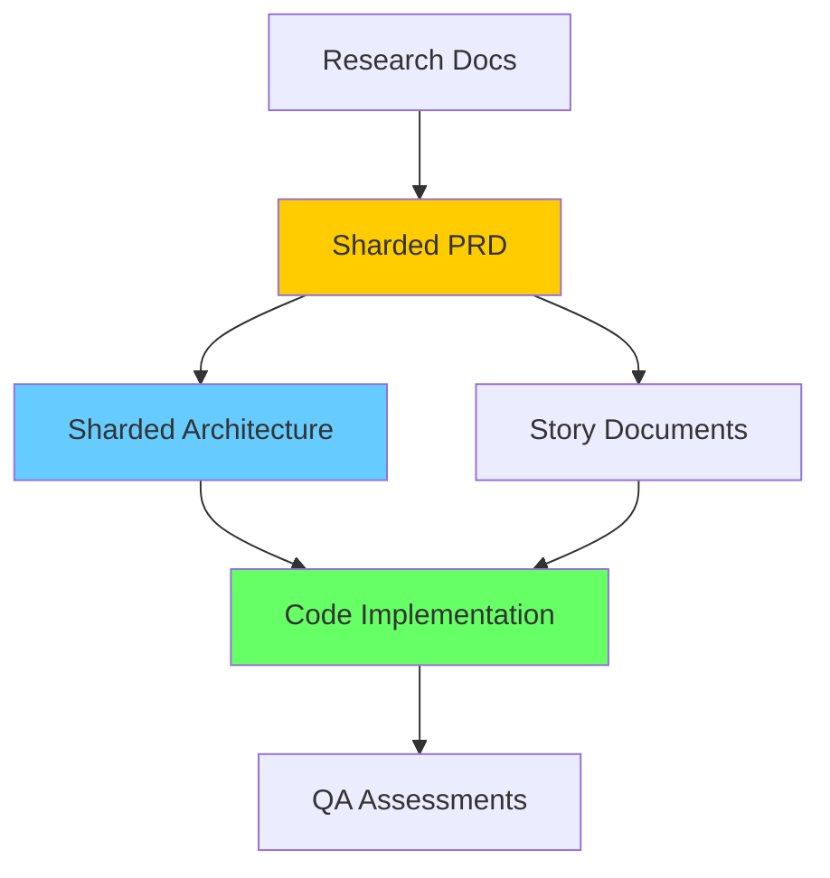

# Sharded Documents Review Report

**Date**: January 10, 2025  
**Reviewer**: BMad Orchestrator  
**Purpose**: Systematic review of sharded PRD and Architecture documents for consistency with implemented code

## Executive Summary

This report documents discrepancies between sharded documentation and actual implementation, providing contextual relationships and recommended updates to maintain documentation accuracy.

## 1. SHARDED PRD REVIEW

### 1.1 Epic-to-Story Mapping Verification

#### Epic 1: Capture & Extract
**PRD Definition** (`docs/sharded-prd/epics.poml`):
- batch-capture → Story 1.1 ✅ Mapped
- edge-detection → Story 1.2 ✅ Mapped  
- confidence-scores → Story 1.3 ✅ Mapped
- retry-capture → Story 1.4 ✅ Mapped

**Implementation Status**:
- Story 1.1: Ready for Done (not marked complete)
- Story 1.2: Complete
- Story 1.3: In Progress
- Story 1.4: Ready

**Discrepancy**: None - PRD aligns with stories

#### Epic 2: Review & Correct
**PRD Definition**:
- inline-editing → Story 2.1 ✅ Mapped
- merchant-normalization → Story 2.2 ✅ Mapped
- receipt-notes → Story 2.3 ❓ (Listed as "Zoom and Pan" in tracker)
- image-reference → Story 2.4 ❓ (Listed as "Quick Actions" in tracker)

**Implementation Status**:
- Story 2.1: Complete
- Story 2.2: Complete
- Story 2.3: Complete (but different feature)
- Story 2.4: Complete (but different feature)

**⚠️ DISCREPANCY FOUND**: 
- PRD defines "receipt-notes" and "image-reference"
- Implementation has "Zoom and Pan" and "Quick Actions"
- Features may have evolved during development

#### Epic 3: Organize & Export
**PRD Definition**:
- date-range-export → Maps to Story 3.11 ✅
- csv-format-options → Maps to Story 3.10 ✅
- csv-preview → Included in export features ✅
- export-validation → Maps to Story 3.9 ✅
- bulk-delete → Maps to Story 3.13 ✅

**Implementation Status**:
- Story 3.9: CSV Validation - Complete
- Story 3.10: CSV Format Options - Approved
- Story 3.11: Date Range Export - Complete
- Story 3.12: OAuth Integration - Complete (NOT IN PRD)
- Story 3.13: Bulk Delete - Complete

**⚠️ DISCREPANCY FOUND**:
- Story 3.12 (OAuth Integration) not defined in original PRD
- This appears to be an added enhancement

#### Epic 4: Settings & Support
**PRD Definition**:
- default-export-format
- storage-usage
- confidence-thresholds
- data-export

**Implementation Status**: Not started (Ready for implementation)

**Discrepancy**: None - Awaiting implementation

### 1.2 User Persona Consistency

**PRD Personas** (`docs/sharded-prd/user-personas.poml`):
- Sarah (Restaurant Owner)
- Mike (Contractor)
- Linda (Bookkeeper)

**Story Implementation**: ✅ Consistently uses same personas

## 2. SHARDED ARCHITECTURE REVIEW

### 2.1 Technology Stack Discrepancies

#### Backend Technology
**Architecture Document** (`docs/sharded-architecture/tech-stack.md`):
```
backend_layer:
  language: "Dart"
  rationale: "Same language as frontend, no context switching"
```

**Actual Implementation**:
```
Backend:
  API_Framework: Next.js 15.5.2
  Runtime: Node.js with Vercel Edge
  Language: TypeScript/JavaScript
```

**⚠️ MAJOR DISCREPANCY**:
- Architecture specifies "Dart everywhere" strategy
- Implementation uses Next.js/TypeScript for API
- This is a fundamental architectural deviation

#### OCR Technology
**Architecture Document**:
```
Primary: Google ML Kit (on-device)
Fallback: TensorFlow Lite
```

**Code Implementation**: 
- Uses Google ML Kit ✅ Aligned
- TensorFlow Lite fallback present ✅ Aligned

### 2.2 API Specification Alignment

**Architecture** (`docs/sharded-architecture/api-specification.md`):
- Defines RESTful endpoints
- Focus on local processing

**Implementation** (`apps/api/`):
- Has OAuth endpoints (not in original spec)
- CSV validation endpoints ✅ Aligned
- Export endpoints ✅ Aligned

**⚠️ DISCREPANCY**:
- OAuth integration added beyond original specification
- API expanded for cloud service integration

### 2.3 Database Schema

**Architecture** (`docs/sharded-architecture/database-schema.md`):
- SQLite schema defined
- RxDB reactive layer mentioned

**Implementation**:
- SQLite via sqflite ✅ Aligned
- RxDB not clearly visible in code
- Hive used for settings (not in architecture)

**⚠️ MINOR DISCREPANCY**:
- Hive addition for settings storage
- RxDB reactive layer implementation unclear

## 3. CONTEXTUAL RELATIONSHIPS ANALYSIS

### 3.1 Documentation Flow Hierarchy



### 3.2 Story Evolution Pattern

1. **PRD Epic** → Generic user story
2. **Story Document** → Specific implementation details
3. **Implementation** → May deviate based on technical constraints
4. **QA Assessment** → Validates against story, not PRD

**Finding**: Stories act as living documents that evolve from PRD

### 3.3 Technology Decision Evolution

**Original Vision** (Architecture):
- Dart-only stack
- Fully offline
- No cloud dependencies

**Implemented Reality**:
- Flutter + Next.js hybrid
- Offline-first with cloud enhancements
- OAuth integrations for accounting software

**Rationale for Change** (Inferred):
- Next.js better for OAuth handling
- Vercel deployment simpler than Dart server
- JavaScript ecosystem richer for web APIs

## 4. RECOMMENDED UPDATES

### 4.1 Critical Updates Needed

#### Update 1: Architecture Tech Stack
**File**: `docs/sharded-architecture/tech-stack.md`
**Change**: Document the hybrid Flutter/Next.js architecture
```yaml
backend_layer:
  api_gateway:
    framework: "Next.js"
    runtime: "Vercel Edge"
    purpose: "OAuth, validation, cloud integrations"
  local_processing:
    language: "Dart (within Flutter)"
    purpose: "OCR, image processing, offline operations"
```

#### Update 2: PRD Epic 3 Stories
**File**: `docs/sharded-prd/epics.poml`
**Add**: OAuth Integration story
```xml
<story id="oauth-integration" priority="P0" persona="Linda">
  <narrative>As Linda, I want to connect to QuickBooks/Xero, 
             so exports work seamlessly</narrative>
  <acceptance-criteria>OAuth flow complete, tokens secure</acceptance-criteria>
</story>
```

#### Update 3: PRD Epic 2 Clarification
**File**: `docs/sharded-prd/epics.poml`
**Clarify**: What happened to receipt-notes and image-reference stories
- Either update to match implemented "Zoom/Pan" and "Quick Actions"
- Or document why original stories were changed

### 4.2 Minor Updates Recommended

1. **Add Hive to Architecture**
   - File: `docs/sharded-architecture/database-schema.md`
   - Add section for settings persistence via Hive

2. **Document Story Status Workflow**
   - Create: `docs/STORY_LIFECYCLE.md`
   - Define: Draft → Review → Ready for Done → Complete

3. **Update API Specification**
   - File: `docs/sharded-architecture/api-specification.md`
   - Add OAuth endpoints documentation
   - Add rate limiting details

### 4.3 Documentation Maintenance Process

**Recommended Process**:
1. **Story Creation**: Always reference sharded PRD epic
2. **Implementation Changes**: Document in story why diverging
3. **Post-Implementation**: Update sharded docs if major changes
4. **Quarterly Review**: Full consistency check of all docs

## 5. SYSTEMIC OBSERVATIONS

### 5.1 Documentation Strengths
- ✅ Comprehensive sharded structure
- ✅ Clear epic-to-story traceability
- ✅ Detailed architecture specifications
- ✅ QA assessments for each story

### 5.2 Documentation Gaps
- ❌ Technology pivot not documented
- ❌ Story evolution rationale missing
- ❌ No change log for architecture decisions
- ❌ Missing deployment architecture updates

### 5.3 Contextual Integrity Assessment

**Overall Score**: 7/10

**Strengths**:
- Strong foundational documentation
- Clear user personas maintained
- Epic structure largely intact

**Weaknesses**:
- Technology decisions evolved without updates
- Some story mappings unclear
- Backend architecture significantly different

## 6. PRIORITY ACTION ITEMS

### Immediate (P0)
1. Update `tech-stack.md` to reflect Next.js backend
2. Document Story 3.12 (OAuth) in PRD
3. Clarify Epic 2 story changes

### Short-term (P1)
1. Add deployment architecture section
2. Document Hive usage
3. Create story lifecycle documentation

### Long-term (P2)
1. Establish quarterly doc review process
2. Add architecture decision records (ADRs)
3. Create change log for major pivots

## 7. CONCLUSION

The sharded documentation provides a solid foundation but has diverged from implementation in key areas, particularly:

1. **Backend technology stack** (Dart → Next.js)
2. **OAuth integration** (added feature)
3. **Epic 2 story evolution** (features changed)

These discrepancies are natural in agile development but should be documented to maintain documentation integrity. The contextual relationships between documents remain strong, with clear traceability from PRD to implementation.

**Recommendation**: Prioritize updating the architecture tech stack documentation and adding the OAuth story to the PRD. These changes will significantly improve documentation accuracy without requiring major restructuring.

---
*Generated by BMad Orchestrator*  
*Review Date: January 10, 2025*  
*Next Review: After Epic 4 Implementation*