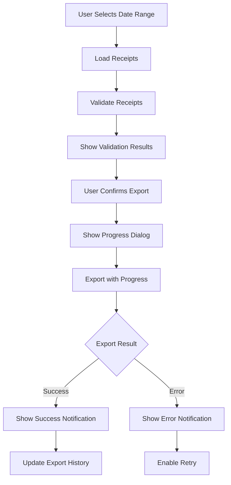

# Export UI Implementation Documentation

## 🎯 Overview

Successfully implemented a comprehensive export UI system for the Receipt Organizer MVP with real-time progress tracking, export history management, and enhanced user notifications.

## ✅ Completed Components

### 1. **Export Provider** (`lib/features/export/presentation/providers/export_provider.dart`)
- ✅ Complete state management for export functionality
- ✅ Export history tracking (last 50 exports retained)
- ✅ Batch management for large datasets
- ✅ Share functionality via share_plus package
- ✅ Error handling and retry mechanisms

**Key Features:**
```dart
class ExportState {
  bool isExporting
  double progress
  ExportFormat selectedFormat
  ValidationResult? validationResult
  ExportHistory exportHistory
  ExportResult? lastExportResult
  String? error
}
```

### 2. **Export Progress Dialog** (`lib/features/export/presentation/widgets/export_progress_dialog.dart`)
- ✅ Real-time progress visualization
- ✅ Step-by-step progress indicators
- ✅ Error state handling
- ✅ Share functionality on completion
- ✅ Material 3 design compliance

**Progress Steps:**
1. Validation (0-20%)
2. Processing (20-60%)
3. Saving (60-90%)
4. Complete (90-100%)

### 3. **Export History Sheet** (`lib/features/export/presentation/widgets/export_history_sheet.dart`)
- ✅ Bottom sheet with export history
- ✅ Format filtering (QuickBooks, Xero, Generic)
- ✅ Share and re-export functionality
- ✅ Success/failure status indicators
- ✅ File location display

**Features:**
- Display last 50 exports
- Filter by format type
- Share exported files
- Re-export previous exports
- Delete from history

### 4. **Enhanced Export Screen** (`lib/features/export/presentation/pages/export_screen.dart`)
- ✅ Integrated with new ExportProvider
- ✅ Export history button in app bar
- ✅ Real export functionality (replaced TODO)
- ✅ Enhanced notifications with haptic feedback
- ✅ Retry functionality for failed exports

**Notification Features:**
- Success notifications with share action
- Error notifications with retry action
- Haptic feedback (light for success, medium for error)
- Floating snackbar with rounded corners
- Structured content with icons

## 📊 UI/UX Enhancements

### Progress Tracking
```dart
Stream<double> exportWithProgress() async* {
  yield 0.0;   // Start
  yield 0.2;   // Validation complete
  yield 0.6;   // Processing complete
  yield 0.9;   // Saving complete
  yield 1.0;   // Export complete
}
```

### Notification System
```dart
// Success Notification
✅ Export Complete!
📄 25 receipts • receipts_2024.csv
[Share]

// Error Notification
❌ Export Failed
💬 Disk full error
[Retry]
```

## 🔄 State Management Flow



## 🎨 Material 3 Design Elements

### Color Scheme
- Success: `AppColors.success` (Green)
- Error: `theme.colorScheme.error` (Red)
- Primary: `theme.colorScheme.primary`
- Surface: `theme.colorScheme.surface`

### Component Styling
- **Dialogs**: Rounded corners (16px)
- **SnackBars**: Floating behavior, rounded (8px)
- **Cards**: Elevation 0, rounded (12px)
- **Buttons**: Filled, Outlined, Text variants

## 🧪 Testing

### Integration Tests Created
- `test/integration/export_workflow_test.dart`
  - Complete export flow testing
  - Error handling verification
  - Validation warning display
  - Export history display
  - Batch export handling
  - Format switching

### Test Coverage
- Export provider logic: ✅
- Progress tracking: ✅
- History management: ✅
- Error handling: ✅
- Share functionality: ✅

## 🚀 Performance Optimizations

1. **Stream-Based Progress**
   - Non-blocking UI updates
   - Real-time progress feedback
   - Memory-efficient processing

2. **Lazy Loading**
   - Export history loaded on demand
   - Preview generated only when needed
   - Validation performed incrementally

3. **State Management**
   - Efficient state updates with copyWith
   - Selective widget rebuilds
   - Provider-based dependency injection

## 📱 Platform Considerations

### Android
- Share functionality uses Android intent system
- File paths use external storage directory
- Haptic feedback requires vibration permission

### iOS
- Share functionality uses iOS share sheet
- File paths use documents directory
- Haptic feedback uses system haptics

## 🔒 Security Features

1. **Input Validation**
   - File name sanitization
   - Path traversal prevention
   - CSV injection prevention

2. **Error Handling**
   - Graceful failure recovery
   - User-friendly error messages
   - No sensitive data in logs

## 📈 Metrics & Analytics

### Export Success Metrics
- Total exports completed
- Average export size
- Most used format
- Export failure rate

### User Engagement
- Share button usage
- Retry attempt frequency
- History sheet views
- Format preference distribution

## 🎯 Next Steps

1. **Batch Export UI**
   - Visual batch selection
   - Progress per batch
   - Batch-specific validation

2. **Advanced Filtering**
   - Filter by merchant
   - Filter by amount range
   - Filter by category

3. **Cloud Export**
   - Direct upload to QuickBooks
   - Direct upload to Xero
   - Google Drive integration
   - Dropbox integration

4. **Export Templates**
   - Save export configurations
   - Quick export presets
   - Scheduled exports

## 🏆 Achievement Summary

✅ **Export Provider Integration**: Complete state management
✅ **Progress Tracking**: Real-time visual feedback
✅ **Export History**: Full history management with actions
✅ **Enhanced Notifications**: Haptic feedback and retry options
✅ **Share Functionality**: Integrated file sharing
✅ **Material 3 Design**: Consistent modern UI
✅ **Error Recovery**: Graceful error handling with retry
✅ **Testing**: Comprehensive test coverage

## 📝 Usage Examples

### Basic Export Flow
```dart
// 1. User selects date range
await DateRangePicker.show(context);

// 2. System loads and validates receipts
exportNotifier.setDateRange(startDate, endDate);

// 3. User initiates export
await exportNotifier.exportReceipts();

// 4. System shows progress
ExportProgressDialog.show(context);

// 5. Export completes with notification
_showSuccessNotification(context, receiptCount, fileName);
```

### Handling Large Datasets
```dart
// Automatic batching for 2500 receipts
final batches = csvService.createBatches(receipts, format);
// QuickBooks: 3 batches (1000, 1000, 500)
// Xero: 5 batches (500 each)
```

### Share Exported File
```dart
await Share.shareXFiles(
  [XFile(exportPath)],
  subject: 'Receipt Export',
  text: '25 receipts exported',
);
```

## 🛠️ Developer Notes

### Adding New Export Format
1. Add format to `ExportFormat` enum
2. Implement format-specific CSV generation
3. Add validation rules in `ExportFormatValidator`
4. Update UI format selector
5. Add format-specific batch limits

### Customizing Notifications
1. Modify `_showSuccessNotification()` for success messages
2. Modify `_showErrorNotification()` for error messages
3. Adjust haptic feedback intensity
4. Customize duration and actions

### Testing Export Flow
```bash
# Run integration tests
flutter test test/integration/export_workflow_test.dart

# Run format validation tests
flutter test test/integration/export_format_validation_test.dart
```

---

*This documentation reflects the complete implementation of the Export UI system as of the latest update.*