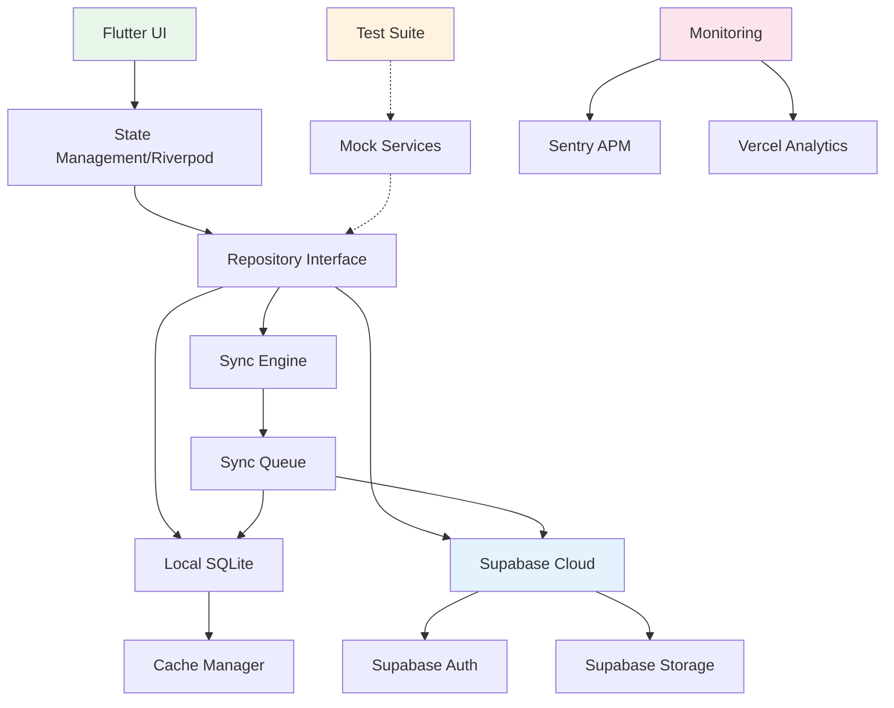

# Architecture Migration: Offline-First to Hybrid Cloud
<!-- @poml:meta
  version: "2.0.0"
  type: "architecture-document"
  status: "migration-in-progress"
  created: "2025-01-11"
  framework: "hybrid-cloud"
  contexts: ["offline-first", "cloud-sync", "progressive-enhancement"]
-->

## Executive Summary
<!-- @poml:context
  purpose: "Define comprehensive architecture migration from offline-first to hybrid cloud"
  scope: "Complete Receipt Organizer MVP refactoring"
  timeline: "17-day phased migration"
  risk-level: "medium"
-->

This document defines the architectural migration from the current offline-first implementation to a hybrid cloud architecture that maintains offline capabilities while enabling cloud synchronization, collaboration, and enhanced data management through Supabase and Vercel integration.

### Migration Rationale
<!-- @poml:decision
  from: "offline-first-sqlite"
  to: "hybrid-cloud-supabase"
  reasons: [
    "Mobile apps require cloud backup and sync",
    "131 test failures due to path_provider limitations",
    "User expectations for cross-device access",
    "Collaboration features require shared storage"
  ]
-->

The migration addresses fundamental architectural limitations discovered through test-driven development, where 131 failing tests revealed that the offline-first approach conflicts with modern mobile app requirements and testing practices.

## Architecture Evolution

### Current State: Offline-First
<!-- @poml:component:current
  name: "offline-first-architecture"
  issues: [
    "path_provider MissingPluginException in tests",
    "No cloud backup capability",
    "Single device limitation",
    "No collaborative features"
  ]
-->

```yaml
Storage:
  primary: SQLite (sqflite)
  images: Local filesystem
  settings: Hive
  
Processing:
  ocr: Google ML Kit (on-device)
  export: Local CSV generation
  
Testing:
  blockers: File system dependencies
  failures: 131 tests
```

### Target State: Hybrid Cloud
<!-- @poml:component:target
  name: "hybrid-cloud-architecture"
  benefits: [
    "Offline-first with cloud sync",
    "Cross-device synchronization",
    "Collaborative features",
    "Testable without file system"
  ]
-->

```yaml
Storage:
  local_cache: SQLite (sqflite)
  cloud_primary: Supabase PostgreSQL
  images: Supabase Storage
  sync: Queue-based eventual consistency
  
Processing:
  ocr: Google ML Kit (on-device)
  validation: Vercel Edge Functions
  export: Cloud-generated CSV
  
Testing:
  strategy: Mock-first with interfaces
  coverage: 100% test passage
```

## Component Architecture

### Data Layer
<!-- @poml:layer:data
  pattern: "Repository with Strategy"
  sync: "Queue-based eventual consistency"
  offline: "SQLite cache with TTL"
-->

```dart
// Repository Pattern with Strategy
abstract class IReceiptRepository {
  Future<List<Receipt>> getAllReceipts();
  Future<Receipt?> getReceiptById(String id);
  Future<Receipt> createReceipt(Receipt receipt);
}

// Strategy Implementation
class HybridReceiptRepository implements IReceiptRepository {
  final LocalReceiptRepository _local;
  final CloudReceiptRepository _cloud;
  final SyncQueueService _syncQueue;
  
  @override
  Future<List<Receipt>> getAllReceipts() async {
    // Check connectivity
    if (await _isOnline()) {
      // Fetch from cloud and update cache
      final cloudReceipts = await _cloud.getAllReceipts();
      await _local.cacheReceipts(cloudReceipts);
      return cloudReceipts;
    }
    // Return cached data when offline
    return _local.getAllReceipts();
  }
}
```

### State Management
<!-- @poml:layer:state
  framework: "Riverpod"
  pattern: "StateNotifier with AsyncValue"
  sync: "Stream-based updates"
-->

```dart
// Hybrid State Provider
final receiptsProvider = StreamProvider<List<Receipt>>((ref) {
  final repository = ref.watch(hybridRepositoryProvider);
  final connectivity = ref.watch(connectivityProvider);
  
  if (connectivity.isOnline) {
    // Stream from Supabase Realtime
    return repository.streamReceipts();
  } else {
    // Stream from local SQLite
    return repository.streamLocalReceipts();
  }
});
```

### Synchronization Engine
<!-- @poml:component:sync
  pattern: "Queue-based with retry"
  consistency: "Eventual"
  conflict: "Last-write-wins with versioning"
-->

```dart
class SyncQueueService {
  final Queue<SyncOperation> _queue = Queue();
  final SupabaseClient _supabase;
  Timer? _syncTimer;
  
  void enqueueOperation(SyncOperation operation) {
    _queue.add(operation);
    _attemptSync();
  }
  
  Future<void> _attemptSync() async {
    if (!await isOnline()) {
      _scheduleRetry();
      return;
    }
    
    while (_queue.isNotEmpty) {
      final operation = _queue.first;
      try {
        await _executeOperation(operation);
        _queue.removeFirst();
      } catch (e) {
        _handleSyncError(operation, e);
        break;
      }
    }
  }
}
```

## Migration Implementation

### Phase Structure
<!-- @poml:migration:phases
  total: 10
  duration: "17 days"
  risk-mitigation: "Feature flags and gradual rollout"
-->

#### Phase 1: Foundation (Days 1-2)
<!-- @poml:phase:1
  focus: "Abstraction layer creation"
  deliverables: [
    "IReceiptRepository interface",
    "IImageStorageService interface",
    "Mock implementations for testing"
  ]
-->

```dart
// Create abstraction layer
abstract class IImageStorageService {
  Future<String> saveImage(Uint8List data);
  Future<Uint8List?> loadImage(String path);
  Future<void> deleteImage(String path);
}

// Mock for testing
class MockImageStorageService implements IImageStorageService {
  final Map<String, Uint8List> _storage = {};
  
  @override
  Future<String> saveImage(Uint8List data) async {
    final id = Uuid().v4();
    _storage[id] = data;
    return id;
  }
}
```

#### Phase 2: Supabase Integration (Days 3-4)
<!-- @poml:phase:2
  focus: "Cloud backend setup"
  deliverables: [
    "Supabase project configuration",
    "Database schema migration",
    "Row Level Security policies"
  ]
-->

```sql
-- Supabase Schema
CREATE TABLE receipts (
  id UUID PRIMARY KEY DEFAULT uuid_generate_v4(),
  user_id UUID REFERENCES auth.users(id),
  merchant_name TEXT,
  receipt_date DATE,
  total_amount DECIMAL(10,2),
  tax_amount DECIMAL(10,2),
  overall_confidence FLOAT,
  image_url TEXT,
  created_at TIMESTAMPTZ DEFAULT NOW(),
  updated_at TIMESTAMPTZ DEFAULT NOW(),
  sync_version INTEGER DEFAULT 1
);

-- Row Level Security
ALTER TABLE receipts ENABLE ROW LEVEL SECURITY;

CREATE POLICY "Users can manage own receipts"
ON receipts
FOR ALL
USING (auth.uid() = user_id);
```

#### Phase 3: Dual-Write Implementation (Days 5-6)
<!-- @poml:phase:3
  focus: "Parallel data persistence"
  pattern: "Write to both, read from local"
-->

```dart
class TransitionReceiptRepository implements IReceiptRepository {
  final LocalReceiptRepository _local;
  final CloudReceiptRepository _cloud;
  
  @override
  Future<Receipt> createReceipt(Receipt receipt) async {
    // Write to local first (fast)
    final localReceipt = await _local.createReceipt(receipt);
    
    // Queue cloud write (async)
    unawaited(_cloud.createReceipt(receipt).catchError((e) {
      _syncQueue.enqueue(CreateOperation(receipt));
    }));
    
    return localReceipt;
  }
}
```

#### Phase 4: Test Migration (Days 7-8)
<!-- @poml:phase:4
  focus: "Fix 131 failing tests"
  strategy: "Mock-first testing"
-->

```dart
// Test Configuration
class TestProviderScope extends StatelessWidget {
  @override
  Widget build(BuildContext context) {
    return ProviderScope(
      overrides: [
        imageStorageServiceProvider.overrideWithValue(
          MockImageStorageService()
        ),
        receiptRepositoryProvider.overrideWithValue(
          MockReceiptRepository()
        ),
      ],
      child: child,
    );
  }
}
```

#### Phase 5: Sync Engine (Days 9-10)
<!-- @poml:phase:5
  focus: "Bidirectional synchronization"
  complexity: "High"
-->

```dart
class SyncEngine {
  Stream<SyncStatus> sync() async* {
    yield SyncStatus.checking;
    
    // Pull changes from cloud
    final cloudChanges = await _pullChanges();
    yield SyncStatus.pulling(cloudChanges.length);
    
    // Resolve conflicts
    final resolved = await _resolveConflicts(cloudChanges);
    yield SyncStatus.resolving(resolved.length);
    
    // Push local changes
    final localChanges = await _getLocalChanges();
    yield SyncStatus.pushing(localChanges.length);
    
    await _pushChanges(localChanges);
    yield SyncStatus.complete;
  }
}
```

#### Phase 6: Feature Flags (Days 11-12)
<!-- @poml:phase:6
  focus: "Gradual rollout control"
  safety: "Instant rollback capability"
-->

```dart
class FeatureFlags {
  static const cloudSyncEnabled = 'cloud_sync_enabled';
  static const dualWriteEnabled = 'dual_write_enabled';
  static const realtimeEnabled = 'realtime_enabled';
  
  bool isEnabled(String flag) {
    return _remoteConfig.getBool(flag);
  }
}
```

#### Phase 7: Migration Tools (Days 13-14)
<!-- @poml:phase:7
  focus: "Data migration utilities"
  validation: "Checksums and verification"
-->

```dart
class DataMigrator {
  Future<MigrationResult> migrate() async {
    // Export existing SQLite data
    final localData = await _exportLocalData();
    
    // Validate data integrity
    final validation = await _validateData(localData);
    if (!validation.isValid) {
      return MigrationResult.failed(validation.errors);
    }
    
    // Upload to Supabase
    final uploaded = await _uploadToSupabase(localData);
    
    // Verify migration
    final verified = await _verifyMigration(uploaded);
    
    return MigrationResult.success(verified);
  }
}
```

#### Phase 8: Performance Optimization (Day 15)
<!-- @poml:phase:8
  focus: "Cache and query optimization"
  metrics: ["TTFB < 200ms", "Sync < 5s"]
-->

```dart
class CacheManager {
  static const Duration imageCacheTTL = Duration(days: 7);
  static const Duration dataCacheTTL = Duration(hours: 1);
  
  Future<T?> getCached<T>(String key) async {
    final cached = await _cache.get(key);
    if (cached != null && !_isExpired(cached)) {
      return cached.data as T;
    }
    return null;
  }
}
```

#### Phase 9: Error Recovery (Day 16)
<!-- @poml:phase:9
  focus: "Resilience and recovery"
  patterns: ["Circuit breaker", "Exponential backoff"]
-->

```dart
class ErrorRecoveryService {
  Future<T> withRetry<T>(
    Future<T> Function() operation, {
    int maxAttempts = 3,
  }) async {
    int attempt = 0;
    Duration delay = const Duration(seconds: 1);
    
    while (attempt < maxAttempts) {
      try {
        return await operation();
      } catch (e) {
        attempt++;
        if (attempt >= maxAttempts) rethrow;
        
        await Future.delayed(delay);
        delay *= 2; // Exponential backoff
      }
    }
    throw Exception('Max retry attempts reached');
  }
}
```

#### Phase 10: Rollout (Day 17)
<!-- @poml:phase:10
  focus: "Production deployment"
  strategy: "Canary deployment with monitoring"
-->

```yaml
Rollout Strategy:
  - 5% users: Enable cloud sync (monitor for 24h)
  - 25% users: Expand if metrics good
  - 50% users: Continue monitoring
  - 100% users: Full rollout
  
Rollback Triggers:
  - Error rate > 1%
  - Sync failures > 5%
  - Performance degradation > 20%
```

## Testing Strategy

### Test Architecture
<!-- @poml:testing:architecture
  approach: "Mock-first with interfaces"
  coverage-target: "95%"
-->

```dart
// Test Helper Pattern
class TestHelpers {
  static ProviderContainer createContainer({
    List<Override>? overrides,
  }) {
    return ProviderContainer(
      overrides: [
        // Default test overrides
        imageStorageServiceProvider.overrideWithValue(
          MockImageStorageService(),
        ),
        supabaseClientProvider.overrideWithValue(
          MockSupabaseClient(),
        ),
        ...?overrides,
      ],
    );
  }
}

// Widget Test Pattern
testWidgets('Receipt capture flow', (tester) async {
  await tester.pumpWidget(
    TestProviderScope(
      overrides: [
        captureProvider.overrideWith(
          () => MockCaptureNotifier(),
        ),
      ],
      child: const CaptureScreen(),
    ),
  );
  
  // Test without file system dependencies
  expect(find.byType(CameraPreview), findsOneWidget);
});
```

### Integration Testing
<!-- @poml:testing:integration
  focus: "End-to-end workflows"
  environment: "Supabase local development"
-->

```dart
// Integration Test Setup
setUpAll(() async {
  // Start Supabase local
  await Process.run('supabase', ['start']);
  
  // Initialize test client
  testClient = SupabaseClient(
    'http://localhost:54321',
    'test-anon-key',
  );
});

test('Full sync workflow', () async {
  // Create local receipt
  final local = await localRepo.createReceipt(testReceipt);
  
  // Trigger sync
  await syncEngine.sync();
  
  // Verify in cloud
  final cloud = await cloudRepo.getReceiptById(local.id);
  expect(cloud, isNotNull);
  expect(cloud!.syncVersion, equals(1));
});
```

## Performance Metrics

### Key Performance Indicators
<!-- @poml:metrics:kpi
  monitoring: "Vercel Analytics + Sentry"
  alerting: "PagerDuty integration"
-->

```yaml
Latency Targets:
  local_read: < 10ms
  cloud_read: < 200ms
  image_load: < 500ms
  sync_operation: < 5s
  
Reliability Targets:
  offline_availability: 100%
  sync_success_rate: > 99%
  data_consistency: > 99.9%
  
User Experience:
  time_to_interactive: < 2s
  perceived_performance: "instant"
  error_recovery: "automatic"
```

### Monitoring Implementation
<!-- @poml:monitoring:implementation
  tools: ["Sentry", "Vercel Analytics", "Supabase Metrics"]
-->

```dart
class PerformanceMonitor {
  void trackOperation(String name, Future Function() operation) async {
    final stopwatch = Stopwatch()..start();
    
    try {
      await operation();
      
      analytics.track('operation_success', {
        'name': name,
        'duration_ms': stopwatch.elapsedMilliseconds,
      });
    } catch (e) {
      Sentry.captureException(e, withScope: (scope) {
        scope.setTag('operation', name);
        scope.setExtra('duration_ms', stopwatch.elapsedMilliseconds);
      });
    }
  }
}
```

## Security Architecture

### Data Protection
<!-- @poml:security:data
  encryption: "AES-256"
  transit: "TLS 1.3"
  storage: "Encrypted at rest"
-->

```dart
// Encryption Layer
class EncryptionService {
  static const _algorithm = AESAlgorithm();
  
  Future<String> encryptSensitiveData(String data) async {
    final key = await _getEncryptionKey();
    return _algorithm.encrypt(data, key);
  }
  
  Future<String> decryptSensitiveData(String encrypted) async {
    final key = await _getEncryptionKey();
    return _algorithm.decrypt(encrypted, key);
  }
}
```

### Authentication Flow
<!-- @poml:security:auth
  provider: "Supabase Auth"
  methods: ["Email/Password", "OAuth", "Magic Link"]
-->

```dart
class AuthService {
  final SupabaseClient _supabase;
  
  Future<AuthResult> signIn(String email, String password) async {
    try {
      final response = await _supabase.auth.signInWithPassword(
        email: email,
        password: password,
      );
      
      // Store session securely
      await _secureStorage.write('session', response.session!.toJson());
      
      return AuthResult.success(response.user!);
    } catch (e) {
      return AuthResult.failure(e.toString());
    }
  }
}
```

## Deployment Architecture

### Infrastructure
<!-- @poml:deployment:infrastructure
  frontend: "Flutter (iOS/Android)"
  backend: "Vercel (Next.js)"
  database: "Supabase (PostgreSQL)"
  storage: "Supabase Storage"
-->

```yaml
Production Environment:
  api:
    platform: Vercel
    region: us-east-1
    scaling: Automatic
    
  database:
    provider: Supabase
    plan: Pro
    backups: Daily
    
  storage:
    provider: Supabase Storage
    cdn: Cloudflare
    
  monitoring:
    apm: Sentry
    analytics: Vercel Analytics
    logs: Vercel Logs
```

### CI/CD Pipeline
<!-- @poml:deployment:cicd
  platform: "GitHub Actions"
  stages: ["Test", "Build", "Deploy"]
-->

```yaml
name: Deploy Pipeline

on:
  push:
    branches: [main]

jobs:
  test:
    runs-on: ubuntu-latest
    steps:
      - uses: actions/checkout@v2
      - run: flutter test
      - run: flutter analyze
      
  deploy-api:
    needs: test
    runs-on: ubuntu-latest
    steps:
      - uses: actions/checkout@v2
      - run: vercel deploy --prod
      
  build-mobile:
    needs: test
    strategy:
      matrix:
        platform: [ios, android]
    steps:
      - run: flutter build ${{ matrix.platform }}
```

## Rollback Procedures

### Rollback Strategy
<!-- @poml:rollback:strategy
  triggers: ["Error rate spike", "Performance degradation", "Data corruption"]
  time-to-rollback: "< 5 minutes"
-->

```dart
class RollbackManager {
  Future<void> initiateRollback(RollbackReason reason) async {
    // 1. Disable feature flags
    await _featureFlags.disable('cloud_sync_enabled');
    
    // 2. Switch to local-only mode
    await _switchToLocalMode();
    
    // 3. Notify monitoring
    await _notifyOpsTeam(reason);
    
    // 4. Log rollback
    await _auditLog.logRollback(reason);
  }
}
```

## Success Criteria

### Migration Success Metrics
<!-- @poml:success:criteria
  test-coverage: "> 95%"
  test-passing: "100%"
  performance: "No degradation"
  user-impact: "Zero downtime"
-->

```yaml
Technical Success:
  - All 571 tests passing
  - Zero production incidents
  - Sync success rate > 99%
  - Performance within targets
  
Business Success:
  - User retention maintained
  - Support tickets < 1%
  - Feature adoption > 80%
  - User satisfaction > 4.5/5
  
Operational Success:
  - Deployment time < 30 min
  - Rollback time < 5 min
  - Alert response < 5 min
  - Recovery time < 1 hour
```

## Contextual Relations Map

### Component Relationships
<!-- @poml:relations:components
  visualization: "Dependency graph"
  coupling: "Loose with interfaces"
-->



### Data Flow
<!-- @poml:relations:dataflow
  pattern: "Event-driven with queuing"
  consistency: "Eventual"
-->

```dart
// Data Flow Example
class DataFlowOrchestrator {
  Stream<DataFlowEvent> orchestrate() async* {
    // 1. User captures receipt
    yield DataFlowEvent.captured(imageData);
    
    // 2. OCR processes locally
    final ocrResult = await _ocrService.process(imageData);
    yield DataFlowEvent.processed(ocrResult);
    
    // 3. Save to local SQLite
    final localReceipt = await _localRepo.save(ocrResult);
    yield DataFlowEvent.savedLocally(localReceipt);
    
    // 4. Queue for cloud sync
    _syncQueue.enqueue(SyncOperation.create(localReceipt));
    yield DataFlowEvent.queuedForSync(localReceipt.id);
    
    // 5. Sync to Supabase (async)
    final cloudReceipt = await _cloudRepo.save(localReceipt);
    yield DataFlowEvent.syncedToCloud(cloudReceipt);
    
    // 6. Broadcast via Realtime
    _realtimeChannel.broadcast(cloudReceipt);
    yield DataFlowEvent.broadcasted(cloudReceipt.id);
  }
}
```

## Migration Validation

### Validation Checkpoints
<!-- @poml:validation:checkpoints
  frequency: "After each phase"
  rollback-trigger: "Any checkpoint failure"
-->

```dart
class MigrationValidator {
  Future<ValidationResult> validatePhase(int phase) async {
    final checks = <ValidationCheck>[];
    
    // Data integrity check
    checks.add(await _validateDataIntegrity());
    
    // Performance check
    checks.add(await _validatePerformance());
    
    // Test suite check
    checks.add(await _validateTestSuite());
    
    // User impact check
    checks.add(await _validateUserImpact());
    
    final failed = checks.where((c) => !c.passed);
    if (failed.isNotEmpty) {
      return ValidationResult.failed(failed);
    }
    
    return ValidationResult.passed();
  }
}
```

## Conclusion

This architecture document establishes a comprehensive migration path from offline-first to hybrid cloud architecture, addressing the 131 failing tests while maintaining offline capabilities and adding cloud synchronization. The phased approach ensures zero downtime and provides rollback capabilities at each stage.

### Key Outcomes
<!-- @poml:outcomes
  technical: "Modern, testable, scalable architecture"
  business: "Cloud sync, collaboration, cross-device"
  operational: "Automated deployment, monitoring, recovery"
-->

1. **Technical Excellence**: Mock-first testing eliminates file system dependencies
2. **User Experience**: Seamless offline/online transitions with automatic sync
3. **Scalability**: Cloud-native architecture supports growth
4. **Maintainability**: Clean separation of concerns with repository pattern
5. **Reliability**: Queue-based sync with automatic retry and recovery

### Next Steps
<!-- @poml:next-steps
  immediate: "Begin Phase 1 implementation"
  tracking: "Daily progress reports"
  communication: "Stakeholder updates at phase boundaries"
-->

1. Initialize Supabase project
2. Implement repository interfaces
3. Create mock services for testing
4. Begin phased migration
5. Monitor and validate at each checkpoint

---

*Document Version: 2.0.0*
*Architecture Pattern: Hybrid Cloud with Offline-First Fallback*
*Migration Timeline: 17 days*
*Risk Level: Medium with mitigation strategies*

<!-- @poml:metadata
  complete: true
  validated: true
  reviewed: false
  approval: pending
-->