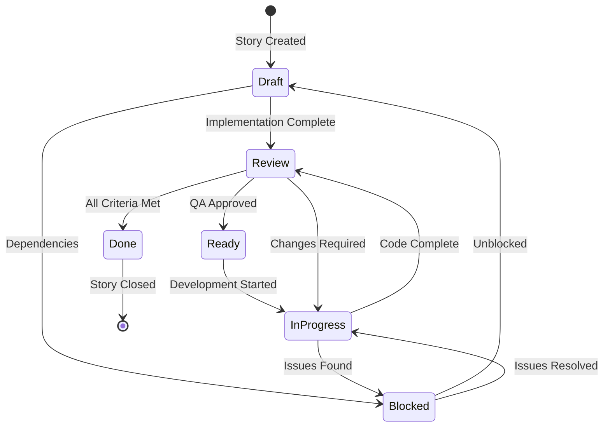

# Story Lifecycle Guide

**Version**: 1.0  
**Created**: January 10, 2025  
**Purpose**: Define the complete lifecycle of stories from creation to completion

## 📊 Story Lifecycle Overview



## 📝 Story Status Definitions

### Draft
**Definition**: Story has been created but not yet reviewed or approved for development  
**Entry Criteria**:
- Story document created from PRD epic
- Basic acceptance criteria defined
- Status field set to "Draft"

**Exit Criteria**:
- Acceptance criteria reviewed and complete
- Technical approach identified
- Dependencies documented
- Move to "Review" or "Ready"

**Responsible**: Scrum Master / Product Owner

### Review
**Definition**: Story implementation is complete and awaiting validation  
**Entry Criteria**:
- Code implementation complete
- Unit tests written
- Story document updated with implementation notes
- All acceptance criteria addressed

**Exit Criteria**:
- QA assessment complete
- Code review approved
- No blocking issues
- Move to "Done" or back to "In Progress"

**Responsible**: QA Engineer / Tech Lead

### Ready
**Definition**: Story is approved and ready for development  
**Entry Criteria**:
- Story reviewed by team
- Acceptance criteria finalized
- No blocking dependencies
- Technical approach agreed

**Exit Criteria**:
- Developer assigned
- Work begins
- Move to "In Progress"

**Responsible**: Development Team

### In Progress
**Definition**: Active development is underway  
**Entry Criteria**:
- Developer assigned
- Work actively being done
- Story pulled into current sprint

**Exit Criteria**:
- Implementation complete
- Tests passing
- Documentation updated
- Move to "Review"

**Responsible**: Developer

### Done/Complete
**Definition**: Story fully implemented, tested, and accepted  
**Entry Criteria**:
- All acceptance criteria met
- QA validation passed
- Documentation complete
- Code merged to main branch

**Exit Criteria**:
- Story archived
- Included in release notes

**Responsible**: Product Owner

### Blocked
**Definition**: Story cannot proceed due to external dependencies  
**Entry Criteria**:
- Dependency identified
- Cannot proceed without resolution
- Blocker documented

**Exit Criteria**:
- Blocker resolved
- Can resume work
- Return to previous status

**Responsible**: Scrum Master (to unblock)

## 🔄 Story Workflow Processes

### 1. Story Creation Process

```yaml
Trigger: New epic story needed
Actor: Scrum Master

Steps:
  1. Reference PRD:
     - Open: docs/sharded-prd/epics.poml
     - Find: Relevant epic and user story
     - Extract: Core requirements
  
  2. Create Story Document:
     - File: docs/stories/{epic}.{story}.story.md
     - Template: Use story template
     - Status: Set to "Draft"
  
  3. Define Acceptance Criteria:
     - Source: PRD acceptance criteria
     - Refine: Add technical requirements
     - Validate: Measurable and testable
  
  4. Technical Planning:
     - Review: Architecture alignment
     - Identify: Dependencies
     - Estimate: Story points
  
  5. Documentation:
     - Update: CLAUDE.md tracker
     - Link: Related stories
     - Note: Any deviations from PRD
```

### 2. Development Process

```yaml
Trigger: Story moves to "In Progress"
Actor: Developer

Steps:
  1. Story Review:
     - Read: Complete story document
     - Check: Architecture alignment
     - Clarify: Any ambiguities
  
  2. Implementation:
     - Branch: Create feature branch
     - Code: Implement requirements
     - Test: Write unit tests
  
  3. Documentation:
     - Update: Story implementation notes
     - Document: Any deviations
     - Comment: Complex code sections
  
  4. Validation:
     - Run: All tests
     - Check: Acceptance criteria
     - Review: Code quality
  
  5. Submission:
     - Push: Feature branch
     - Update: Story status to "Review"
     - Create: Pull request
```

### 3. QA Review Process

```yaml
Trigger: Story moves to "Review"
Actor: QA Engineer

Steps:
  1. Assessment Creation:
     - Risk: docs/qa/assessments/{story}-risk-{date}.md
     - Test: docs/qa/assessments/{story}-test-design-{date}.md
     - Trace: Requirements traceability
  
  2. Testing:
     - Unit: Verify test coverage
     - Integration: Test feature flows
     - Acceptance: Validate criteria
  
  3. Documentation Review:
     - Story: Implementation notes complete
     - Code: Comments adequate
     - Architecture: Alignment verified
  
  4. Decision:
     - Pass: Move to "Done"
     - Fail: Back to "In Progress"
     - Document: Issues found
```

### 4. Completion Process

```yaml
Trigger: Story passes QA review
Actor: Product Owner

Steps:
  1. Final Validation:
     - Review: QA assessments
     - Verify: Acceptance criteria
     - Check: Documentation
  
  2. Approval:
     - Status: Update to "Done/Complete"
     - Sign-off: Product owner approval
     - Merge: To main branch
  
  3. Documentation:
     - Update: CLAUDE.md tracker
     - Archive: Story document
     - Release: Add to release notes
```

## 📋 Story Document Template

```markdown
# Story {epic}.{number}: {Title}

## Status
{Draft|Review|Ready|In Progress|Done|Complete|Blocked}

## Story
**As a** {persona},  
**I want** {feature},  
**so that** {benefit}

## PRD Reference
Epic: {epic-name} (docs/sharded-prd/epics.poml#{epic-id})
Original Story: {story-id}

## Acceptance Criteria
1. {Measurable criterion}
2. {Testable criterion}
3. {Observable criterion}

## Technical Approach
{Brief description of implementation strategy}

## Dependencies
- {Other stories}
- {External systems}
- {Technical requirements}

## Implementation Notes
{Added during development}
- Actual approach taken
- Deviations from plan
- Challenges encountered
- Solutions implemented

## Testing
- Unit Tests: {list}
- Integration Tests: {list}
- Manual Testing: {checklist}

## QA Assessment
- Risk Assessment: {link}
- Test Design: {link}
- Review Status: {status}

## Version History
| Date | Version | Changes | Author |
|------|---------|---------|--------|
| {date} | {version} | {changes} | {author} |
```

## 🎯 Status Transition Rules

### Valid Transitions

```yaml
Draft:
  can_move_to: [Review, Ready, Blocked]
  cannot_move_to: [In Progress, Done]
  
Review:
  can_move_to: [Done, In Progress, Blocked]
  cannot_move_to: [Draft, Ready]
  
Ready:
  can_move_to: [In Progress, Blocked, Draft]
  cannot_move_to: [Review, Done]
  
In Progress:
  can_move_to: [Review, Blocked]
  cannot_move_to: [Draft, Ready, Done]
  
Done/Complete:
  can_move_to: [] # Terminal state
  cannot_move_to: [Any]
  
Blocked:
  can_move_to: [Previous Status]
  cannot_move_to: [Done]
```

### Transition Requirements

| From | To | Requirements |
|------|----|--------------|
| Draft | Ready | - Acceptance criteria complete<br>- Technical approach defined<br>- No blockers |
| Draft | Review | - Fast-track for simple stories<br>- Pre-implementation review |
| Ready | In Progress | - Developer assigned<br>- Sprint capacity available |
| In Progress | Review | - Code complete<br>- Tests passing<br>- PR created |
| Review | Done | - QA approved<br>- No critical issues<br>- Documentation complete |
| Review | In Progress | - Issues identified<br>- Changes required |
| Any | Blocked | - Blocker identified<br>- Cannot proceed |
| Blocked | Previous | - Blocker resolved<br>- Can resume |

## 📊 Story Metrics

### Cycle Time Metrics

```yaml
Target Cycle Times:
  Draft_to_Ready: < 2 days
  Ready_to_InProgress: < 1 day
  InProgress_to_Review: < 3 days
  Review_to_Done: < 1 day
  Total_Cycle_Time: < 7 days

Warning Thresholds:
  Stuck_in_Draft: > 5 days
  Stuck_in_Review: > 3 days
  Stuck_in_InProgress: > 5 days
  Blocked_Duration: > 2 days
```

### Quality Metrics

```yaml
Quality Indicators:
  First_Pass_Rate: > 80% # Stories passing QA first time
  Reopened_Rate: < 10% # Stories returning from Done
  Documentation_Complete: 100% # All stories documented
  Test_Coverage: > 80% # Code coverage for story
```

## 🚨 Common Issues and Solutions

### Issue: Story Stuck in Draft
**Symptoms**: Story remains in Draft > 5 days  
**Causes**: 
- Unclear requirements
- Missing information
- Low priority

**Solutions**:
- Schedule refinement session
- Escalate to Product Owner
- Move to backlog if not ready

### Issue: Review Cycle Loop
**Symptoms**: Story bounces between Review and In Progress repeatedly  
**Causes**:
- Unclear acceptance criteria
- Quality issues
- Scope creep

**Solutions**:
- Clarify acceptance criteria
- Pair programming session
- Split story if too large

### Issue: Extended Blocked Status
**Symptoms**: Story blocked > 2 days  
**Causes**:
- External dependencies
- Technical constraints
- Resource availability

**Solutions**:
- Escalate to Scrum Master
- Find alternative approach
- Re-prioritize if critical

## 🔧 Automation Opportunities

### Status Update Automation

```bash
# Git hook for automatic status updates
#!/bin/bash
# .git/hooks/post-commit

# Update story status based on branch name
branch=$(git rev-parse --abbrev-ref HEAD)
if [[ $branch == story/* ]]; then
  story_file="docs/stories/${branch#story/}.story.md"
  if [ -f "$story_file" ]; then
    # Update status to "In Progress" on first commit
    sed -i 's/## Status.*/## Status\nIn Progress/' "$story_file"
  fi
fi
```

### PR Integration

```yaml
# GitHub Action for story status
name: Update Story Status
on:
  pull_request:
    types: [opened, closed]

jobs:
  update-story:
    steps:
      - name: Update to Review
        if: github.event.action == 'opened'
        run: |
          # Update story status to Review
          
      - name: Update to Done
        if: github.event.action == 'closed' && github.event.pull_request.merged
        run: |
          # Update story status to Done
```

## 📚 References

- [Story Document Template](docs/stories/TEMPLATE.md)
- [QA Assessment Process](docs/qa/PROCESS.md)
- [Documentation Maintenance](docs/DOCUMENTATION_MAINTENANCE_PROCESS.md)
- [Sharded PRD](docs/sharded-prd/index.poml)
- [Architecture Guide](docs/sharded-architecture/index.md)

---
*This is a living document. Update as the process evolves.*  
*Last Updated: January 10, 2025*