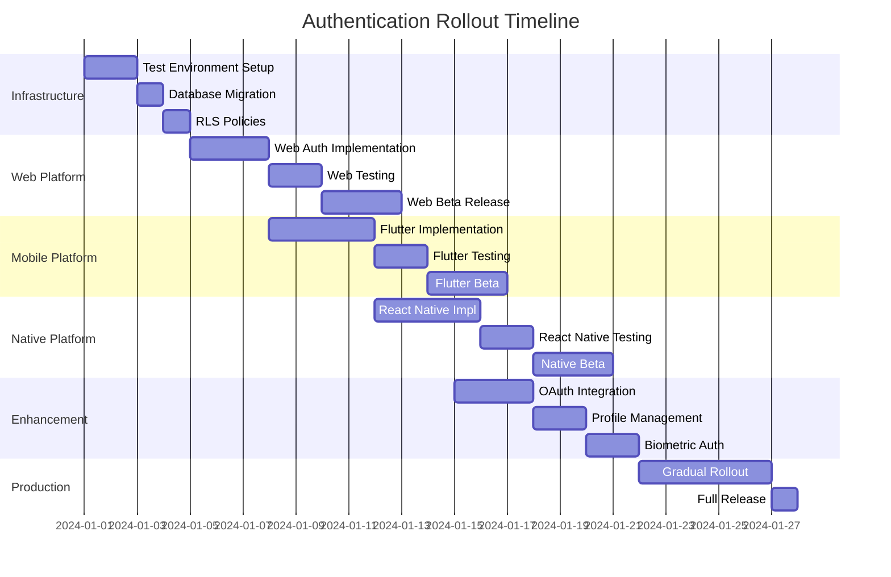

# Phase 2 Authentication Architecture Document

## Introduction

This document defines the technical architecture for implementing Phase 2 Authentication & User Management across the Receipt Organizer's three platforms. It complements the PRD by providing detailed technical patterns, state management approaches, and security implementations.

## Executive Summary

Phase 2 introduces Supabase Auth integration with complex state management requirements across Flutter, Next.js, and React Native platforms. This architecture ensures consistent authentication behavior while respecting platform-specific patterns and maintaining offline-first capabilities.

## High-Level Architecture

```
┌─────────────────────────────────────────────────────────────┐
│                        Client Applications                    │
├─────────────────┬─────────────────┬─────────────────────────┤
│   Flutter Web   │    Next.js      │   React Native          │
│   (Riverpod)    │  (React Context)│  (React Context)        │
└────────┬────────┴────────┬────────┴────────┬───────────────┘
         │                 │                  │
         ├─────────────────┼──────────────────┤
         │          Auth SDK Layer            │
         │  ┌──────────────────────────────┐  │
         │  │ Platform-Specific Adapters   │  │
         │  ├──────────────────────────────┤  │
         │  │ Token Storage Abstraction    │  │
         │  ├──────────────────────────────┤  │
         │  │ Session Management Core      │  │
         │  └──────────────────────────────┘  │
         │                 │                  │
         └─────────────────┼──────────────────┘
                          │
                    ┌─────▼─────┐
                    │ Supabase  │
                    │   Cloud    │
                    ├───────────┤
                    │ Auth      │
                    │ Database  │
                    │ Storage   │
                    │ Realtime  │
                    └───────────┘
```

## Authentication State Management

### Unified Auth State Machine

```
┌──────────┐      ┌──────────┐      ┌──────────┐
│  INIT    │─────▶│ LOADING  │─────▶│  READY   │
└──────────┘      └──────────┘      └──────────┘
                        │                  │
                        ▼                  ▼
                  ┌──────────┐      ┌──────────┐
                  │  ERROR   │      │  AUTHED  │
                  └──────────┘      └──────────┘
                                          │
                                          ▼
                                    ┌──────────┐
                                    │ EXPIRED  │
                                    └──────────┘
```

### State Definitions

| State | Description | Triggers | Actions |
|-------|-------------|----------|---------|
| INIT | Application starting | App launch | Check stored session |
| LOADING | Validating session | Token validation | Show loading UI |
| READY | No valid session | Failed validation | Show login UI |
| AUTHED | Valid session active | Successful auth | Enable app features |
| EXPIRED | Session needs refresh | Token expiry | Auto-refresh attempt |
| ERROR | Auth system failure | Network/system error | Show error UI |

### Platform-Specific State Management

#### Flutter (Riverpod)

```dart
// auth_state_provider.dart
@riverpod
class AuthState extends _$AuthState {
  @override
  FutureOr<AuthStatus> build() async {
    // Initialize from secure storage
    final stored = await secureStorage.read(key: 'session');
    if (stored != null) {
      return _validateAndRefresh(stored);
    }
    return AuthStatus.ready;
  }

  Future<void> signIn(String email, String password) async {
    state = const AsyncValue.loading();
    try {
      final response = await supabase.auth.signInWithPassword(
        email: email,
        password: password,
      );
      await _persistSession(response.session);
      state = AsyncValue.data(AuthStatus.authenticated);
    } catch (e) {
      state = AsyncValue.error(e, StackTrace.current);
    }
  }
}
```

#### Next.js (Server Components + Context)

```typescript
// auth-context.tsx
export const AuthProvider = ({ children }: { children: ReactNode }) => {
  const [session, setSession] = useState<Session | null>(null);
  const [loading, setLoading] = useState(true);

  useEffect(() => {
    // Check cookies for existing session
    const { data: { subscription } } = supabase.auth.onAuthStateChange(
      async (event, session) => {
        if (event === 'SIGNED_IN' || event === 'TOKEN_REFRESHED') {
          await fetch('/api/auth/session', {
            method: 'POST',
            body: JSON.stringify({ session }),
          });
        }
        setSession(session);
        setLoading(false);
      }
    );
    return () => subscription.unsubscribe();
  }, []);

  return (
    <AuthContext.Provider value={{ session, loading }}>
      {children}
    </AuthContext.Provider>
  );
};
```

#### React Native (Expo SecureStore)

```typescript
// useAuth.ts
export const useAuth = () => {
  const [session, setSession] = useState<Session | null>(null);

  const persistSession = async (session: Session) => {
    await SecureStore.setItemAsync('supabase.auth.token', JSON.stringify(session));
  };

  const loadSession = async () => {
    const stored = await SecureStore.getItemAsync('supabase.auth.token');
    if (stored) {
      const session = JSON.parse(stored);
      if (isExpired(session)) {
        return refreshSession(session.refresh_token);
      }
      return session;
    }
    return null;
  };

  return { session, signIn, signOut, loading };
};
```

## Security Architecture

### Token Storage Strategy

| Platform | Storage Method | Security Level | Notes |
|----------|---------------|----------------|-------|
| Flutter Web | Secure Storage (AES) | High | Encrypted localStorage |
| Next.js | HttpOnly Cookies | Very High | CSRF protected |
| iOS | Keychain Services | Very High | Hardware encrypted |
| Android | Android Keystore | Very High | Hardware backed |

### OAuth 2.0 + PKCE Flow

```
User         App          Supabase        Google
 │            │               │              │
 ├─Click──────▶              │              │
 │            ├─Generate──────▶              │
 │            │  PKCE         │              │
 │            │  Challenge    │              │
 │            ├─Redirect──────┼─────────────▶
 │◀───────────┼──────────────┼──────────────┤
 │            │              │   Auth Screen │
 ├─Authorize──┼──────────────┼─────────────▶
 │            │              │◀─────Code─────┤
 │◀─Redirect──┤              │              │
 │            ├─Exchange─────▶              │
 │            │  Code+Verifier│              │
 │            │◀──JWT────────┤              │
 │            ├─Store Token   │              │
 │◀─Success───┤              │              │
```

### Biometric Authentication Flow

```dart
// biometric_auth.dart
class BiometricAuth {
  static Future<bool> authenticate() async {
    final LocalAuthentication auth = LocalAuthentication();

    // Check availability
    final bool canCheckBiometrics = await auth.canCheckBiometrics;
    if (!canCheckBiometrics) return false;

    // Authenticate
    final bool didAuthenticate = await auth.authenticate(
      localizedReason: 'Authenticate to access your receipts',
      options: const AuthenticationOptions(
        biometricOnly: false, // Allow PIN fallback
        stickyAuth: true,
      ),
    );

    if (didAuthenticate) {
      // Retrieve stored credentials
      final credentials = await SecureStorage.read('biometric_session');
      return await refreshSession(credentials);
    }
    return false;
  }
}
```

## Data Layer Integration

### RLS Policy Implementation

```sql
-- User isolation for receipts
CREATE POLICY "Users can only see own receipts" ON receipts
  FOR ALL USING (auth.uid() = user_id);

-- Profile access
CREATE POLICY "Users can view all profiles" ON profiles
  FOR SELECT USING (true);

CREATE POLICY "Users can update own profile" ON profiles
  FOR UPDATE USING (auth.uid() = id);

-- Storage access
CREATE POLICY "Avatar images are publicly accessible" ON storage.objects
  FOR SELECT USING (bucket_id = 'avatars');

CREATE POLICY "Users can upload own avatar" ON storage.objects
  FOR INSERT WITH CHECK (bucket_id = 'avatars' AND auth.uid()::text = (storage.foldername(name))[1]);
```

### User Context Propagation

```typescript
// middleware.ts (Next.js)
export async function middleware(req: NextRequest) {
  const res = NextResponse.next();
  const supabase = createServerClient(req, res);

  const { data: { session } } = await supabase.auth.getSession();

  if (!session && protectedRoutes.includes(req.nextUrl.pathname)) {
    return NextResponse.redirect(new URL('/login', req.url));
  }

  // Add user context to headers for downstream services
  if (session) {
    res.headers.set('X-User-Id', session.user.id);
    res.headers.set('X-User-Email', session.user.email || '');
  }

  return res;
}
```

## Offline/Online Synchronization

### Offline Authentication Strategy

```typescript
interface OfflineAuthState {
  lastOnlineVerification: Date;
  cachedSession: Session;
  pendingActions: AuthAction[];
}

class OfflineAuthManager {
  private readonly OFFLINE_VALIDITY_HOURS = 72;

  async validateOfflineSession(cached: OfflineAuthState): Promise<boolean> {
    const hoursSinceVerification =
      (Date.now() - cached.lastOnlineVerification.getTime()) / (1000 * 60 * 60);

    if (hoursSinceVerification > this.OFFLINE_VALIDITY_HOURS) {
      return false; // Force online verification
    }

    // Check token signature is valid (offline validation)
    return this.verifyTokenSignature(cached.cachedSession.access_token);
  }

  async syncPendingActions(actions: AuthAction[]): Promise<void> {
    for (const action of actions) {
      await this.processPendingAction(action);
    }
  }
}
```

## Session Management

### Token Refresh Strategy

```typescript
class TokenRefreshManager {
  private refreshTimer: NodeJS.Timeout | null = null;

  scheduleRefresh(session: Session) {
    // Clear existing timer
    if (this.refreshTimer) clearTimeout(this.refreshTimer);

    // Calculate refresh time (5 minutes before expiry)
    const expiresAt = session.expires_at || 0;
    const refreshAt = expiresAt - (5 * 60 * 1000);
    const delay = refreshAt - Date.now();

    if (delay > 0) {
      this.refreshTimer = setTimeout(async () => {
        try {
          const { data, error } = await supabase.auth.refreshSession();
          if (!error && data.session) {
            this.scheduleRefresh(data.session);
            await this.persistSession(data.session);
          }
        } catch (error) {
          // Handle refresh failure
          this.handleRefreshError(error);
        }
      }, delay);
    }
  }
}
```

### Inactivity Timeout Implementation

```typescript
class InactivityMonitor {
  private lastActivity: Date = new Date();
  private warningTimer: NodeJS.Timeout | null = null;
  private logoutTimer: NodeJS.Timeout | null = null;

  constructor(
    private warningMinutes: number,
    private timeoutMinutes: number
  ) {}

  resetTimers() {
    this.lastActivity = new Date();

    // Clear existing timers
    if (this.warningTimer) clearTimeout(this.warningTimer);
    if (this.logoutTimer) clearTimeout(this.logoutTimer);

    // Set warning timer
    this.warningTimer = setTimeout(() => {
      this.showWarning();
    }, this.warningMinutes * 60 * 1000);

    // Set logout timer
    this.logoutTimer = setTimeout(() => {
      this.forceLogout();
    }, this.timeoutMinutes * 60 * 1000);
  }

  extendSession() {
    this.resetTimers();
    // Dismiss warning UI
  }
}

// Platform-specific instances
const webMonitor = new InactivityMonitor(25, 30);      // 25 min warning, 30 min logout
const mobileMonitor = new InactivityMonitor(115, 120); // 115 min warning, 120 min logout
```

## MCP Integration Patterns

### Development Workflow with MCP

```typescript
// Development utilities using MCP
class MCPAuthDevelopment {
  // Create test users via MCP
  async createTestUser(email: string): Promise<string> {
    const userId = crypto.randomUUID();
    await mcp.supabase.executeSql(`
      INSERT INTO auth.users (id, email, encrypted_password)
      VALUES ('${userId}', '${email}', crypt('testpass123', gen_salt('bf')));
    `);
    return userId;
  }

  // Monitor auth events
  async monitorAuthEvents(): Promise<AuthLog[]> {
    return await mcp.supabase.getLogs({ service: 'auth' });
  }

  // Test RLS policies
  async testRLSPolicy(userId: string, query: string): Promise<any> {
    return await mcp.supabase.executeSql(`
      SET LOCAL role TO authenticated;
      SET LOCAL request.jwt.claims.sub TO '${userId}';
      ${query}
    `);
  }
}

// UI Component installation via MCP
class MCPComponentSetup {
  async installAuthComponents() {
    // Get shadcn auth components
    const components = await mcp.shadcn.searchItemsInRegistries({
      registries: ['@shadcn'],
      query: 'auth login form'
    });

    // Install selected components
    for (const component of components) {
      await mcp.shadcn.getAddCommandForItems({
        items: [component.name]
      });
    }
  }
}
```

## Performance Considerations

### Authentication Performance Targets

| Operation | Target | Critical | Notes |
|-----------|--------|----------|-------|
| Initial Load | <100ms | <200ms | Check cached session |
| Login | <1s | <2s | Including network |
| Token Refresh | <500ms | <1s | Background operation |
| Biometric Auth | <2s | <3s | Including UI prompt |
| Session Check | <50ms | <100ms | Local validation |

### Optimization Strategies

1. **Eager Token Refresh**: Refresh 5 minutes before expiry
2. **Session Caching**: Store validated sessions in memory
3. **Parallel Initialization**: Load auth state while UI renders
4. **Lazy OAuth Setup**: Only initialize OAuth when needed
5. **Request Deduplication**: Prevent multiple simultaneous refreshes

## Error Handling

### Auth Error Categories

```typescript
enum AuthErrorType {
  NETWORK_ERROR = 'NETWORK_ERROR',           // Retry with backoff
  INVALID_CREDENTIALS = 'INVALID_CREDENTIALS', // Show error, allow retry
  SESSION_EXPIRED = 'SESSION_EXPIRED',       // Auto-refresh
  RATE_LIMITED = 'RATE_LIMITED',             // Show cooldown timer
  SERVER_ERROR = 'SERVER_ERROR',             // Show maintenance message
  INVALID_TOKEN = 'INVALID_TOKEN',           // Force re-login
}

class AuthErrorHandler {
  handle(error: AuthError): AuthErrorResponse {
    switch(error.type) {
      case AuthErrorType.NETWORK_ERROR:
        return {
          retry: true,
          backoff: this.calculateBackoff(error.attempts),
          message: 'Connection issue. Retrying...'
        };
      case AuthErrorType.INVALID_CREDENTIALS:
        return {
          retry: false,
          message: 'Invalid email or password',
          action: 'SHOW_LOGIN_FORM'
        };
      // ... handle other cases
    }
  }
}
```

## Testing Strategy

### Auth Testing Matrix

| Test Category | Flutter | Next.js | React Native | MCP Tools |
|--------------|---------|---------|--------------|-----------|
| Unit Tests | ✓ Mock Supabase | ✓ Mock fetch | ✓ Mock SecureStore | - |
| Integration | ✓ Test DB | ✓ Test DB | ✓ Test DB | executeSql |
| E2E | ✓ Chrome | ✓ Playwright | ✓ Detox | - |
| Load Testing | - | ✓ k6 | - | getLogs |
| Security | ✓ Token validation | ✓ CSRF | ✓ Keychain | getAdvisors |

### Test User Management

```sql
-- Create test users with MCP
INSERT INTO auth.users (id, email, email_confirmed_at)
VALUES
  ('test-user-1', 'test1@example.com', NOW()),
  ('test-user-2', 'test2@example.com', NOW());

-- Create test profiles
INSERT INTO profiles (id, username, full_name)
VALUES
  ('test-user-1', 'testuser1', 'Test User One'),
  ('test-user-2', 'testuser2', 'Test User Two');

-- Grant test permissions
INSERT INTO user_roles (user_id, role)
VALUES
  ('test-user-1', 'tester'),
  ('test-user-2', 'tester');
```

## Migration Strategy

### Phase 2 Rollout Plan



## Monitoring and Observability

### Key Metrics to Track

```typescript
interface AuthMetrics {
  // Performance
  loginDuration: Histogram;        // Time to complete login
  tokenRefreshDuration: Histogram; // Time to refresh token
  sessionCheckDuration: Histogram; // Time to validate session

  // Reliability
  loginSuccessRate: Gauge;         // % successful logins
  tokenRefreshFailures: Counter;   // Failed refresh attempts
  authErrors: Counter;              // Auth errors by type

  // Usage
  activeUsers: Gauge;               // Currently authenticated users
  loginAttempts: Counter;           // Login attempts by method
  logoutEvents: Counter;            // Logout events by trigger

  // Security
  failedLogins: Counter;            // Failed login attempts
  suspiciousActivity: Counter;     // Unusual patterns detected
  tokenExpirations: Counter;        // Expired tokens
}

// MCP monitoring integration
async function collectAuthMetrics(): Promise<AuthMetrics> {
  const logs = await mcp.supabase.getLogs({ service: 'auth' });
  const metrics = processLogs(logs);

  // Check for issues
  const advisors = await mcp.supabase.getAdvisors({ type: 'security' });
  metrics.securityIssues = advisors.filter(a => a.category === 'auth');

  return metrics;
}
```

## Appendix

### A. Platform-Specific Dependencies

#### Flutter
```yaml
dependencies:
  supabase_flutter: ^2.0.0
  flutter_secure_storage: ^9.0.0
  local_auth: ^2.1.0
  flutter_riverpod: ^2.4.0
```

#### Next.js
```json
{
  "dependencies": {
    "@supabase/ssr": "^0.1.0",
    "@supabase/supabase-js": "^2.39.0",
    "jose": "^5.2.0"
  }
}
```

#### React Native
```json
{
  "dependencies": {
    "@supabase/supabase-js": "^2.39.0",
    "expo-secure-store": "^12.8.0",
    "expo-local-authentication": "^13.8.0"
  }
}
```

### B. Configuration Templates

#### Environment Variables
```bash
# Supabase
SUPABASE_URL=https://xbadaalqaeszooyxuoac.supabase.co
SUPABASE_ANON_KEY=eyJ...
SUPABASE_SERVICE_ROLE_KEY=eyJ... # Server-side only

# OAuth
GOOGLE_CLIENT_ID=...
GOOGLE_CLIENT_SECRET=<your-secret-here> # Server-side only

# Session Configuration
SESSION_TIMEOUT_WEB=1800        # 30 minutes
SESSION_TIMEOUT_MOBILE=7200     # 2 hours
SESSION_WARNING_BUFFER=300      # 5 minutes

# Security
ENABLE_BIOMETRIC=true
ENFORCE_MFA=false
MAX_LOGIN_ATTEMPTS=5
```

### C. Common Issues and Solutions

| Issue | Cause | Solution |
|-------|-------|----------|
| Token refresh loop | Clock skew | Sync device time |
| Biometric not working | Permission denied | Request permission explicitly |
| Session lost on refresh | Cookie settings | Set SameSite=Lax |
| OAuth redirect fails | Wrong callback URL | Update Supabase dashboard |
| RLS blocking access | Missing user_id | Ensure migrations ran |

## Conclusion

This architecture provides a robust, secure, and scalable authentication system that:
- Maintains platform-specific best practices
- Preserves offline-first capabilities
- Leverages MCP tools for development efficiency
- Ensures consistent user experience across platforms
- Provides comprehensive monitoring and error handling

The implementation follows the story sequence defined in the PRD, with each story building upon the architectural patterns documented here.