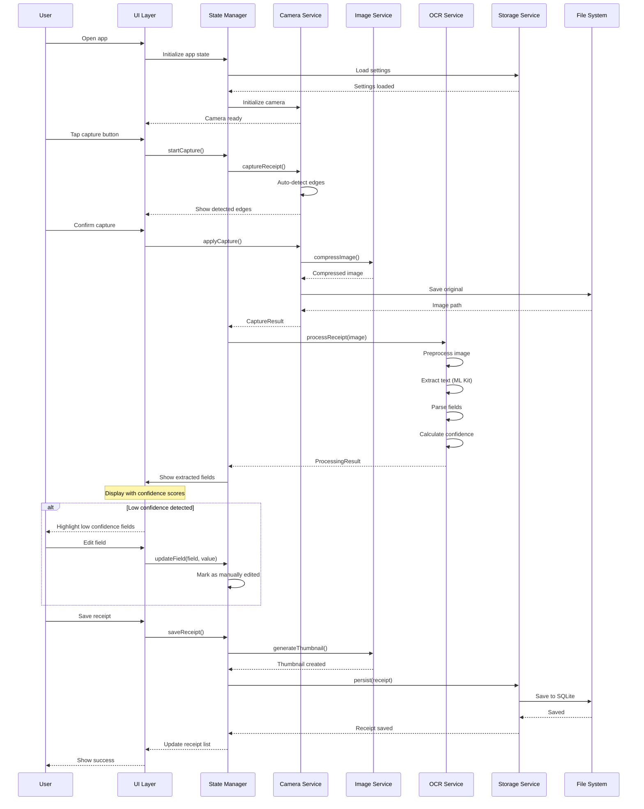
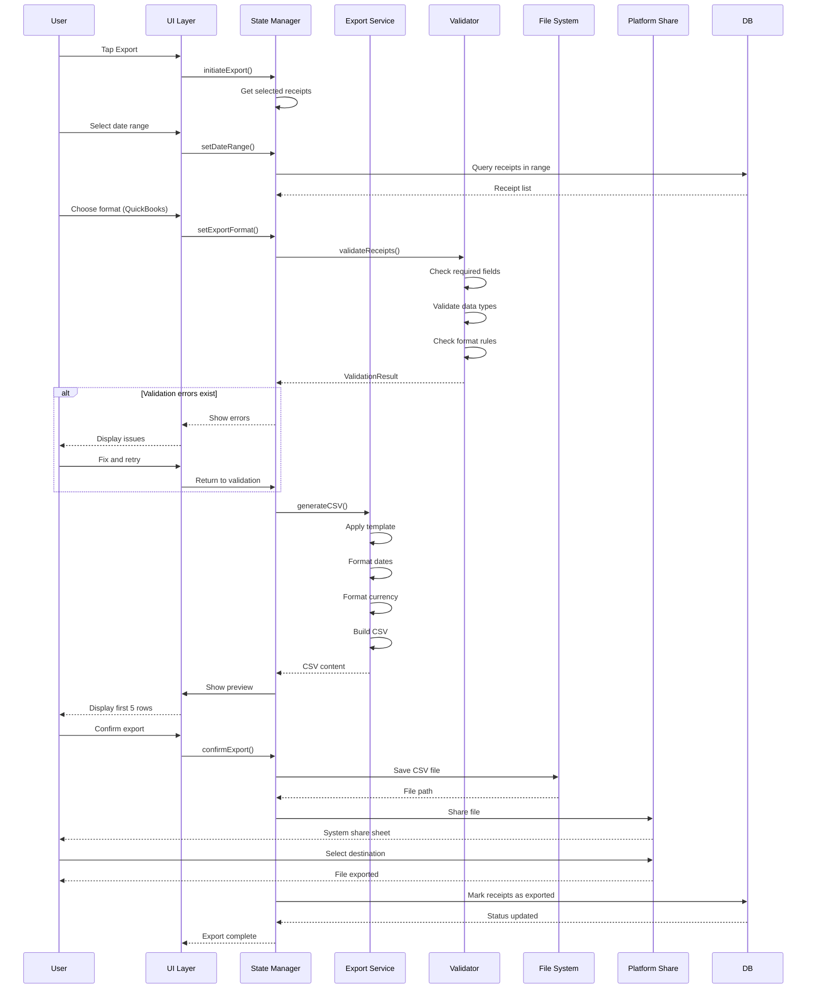

# Core Workflows

```poml
SECTION_METADATA:
  type: "workflow_specification"
  section_number: 8
  focus: "Primary user flows and system processes"
  notation: "Mermaid sequence diagrams with POML annotations"

WORKFLOW_ARCHITECTURE:
  primary_flows: ["receipt_capture", "csv_export"]
  user_interactions: "Optimized for SMB users with 100-500 receipts/month"
  performance_targets: ["<5s capture-to-extract", "<3s export generation"]
  error_recovery: "Graceful fallback strategies at each step"
```

## 8.1 Primary Receipt Capture Workflow

```poml
CAPTURE_WORKFLOW:
  entry_point: "User opens app"
  success_path: "capture -> OCR -> edit (if needed) -> save"
  duration_target: "<5s capture-to-extract p95"
  error_handling: "Fallback OCR engines, manual entry options"
  
WORKFLOW_STEPS:
  initialization:
    - "App state loading"
    - "Settings retrieval"
    - "Camera initialization"
    - "UI readiness confirmation"
  
  capture_phase:
    - "Edge detection overlay"
    - "User confirmation"
    - "Image compression"
    - "File system storage"
  
  processing_phase:
    - "Image preprocessing"
    - "OCR execution (ML Kit primary)"
    - "Field parsing and confidence scoring"
    - "Validation and quality checks"
  
  review_phase:
    - "Confidence score display"
    - "User edit opportunities"
    - "Manual correction tracking"
    - "Final validation"
  
  persistence_phase:
    - "Thumbnail generation"
    - "Database persistence"
    - "UI state update"
    - "Success feedback"
```



```poml
CAPTURE_WORKFLOW_METRICS:
  performance_targets:
    camera_initialization: "<2s"
    edge_detection: "<100ms per frame"
    capture_time: "<500ms"
    image_compression: "<1s"
    ocr_processing: "<5s p95"
    database_save: "<100ms"
  
  success_criteria:
    happy_path_completion: ">70% zero-touch"
    field_accuracy_targets:
      total: ">95%"
      date: ">95%"
      merchant: ">90%"
      tax: ">85%"
  
  error_recovery:
    camera_failure: "Show manual upload option"
    ocr_timeout: "Switch to fallback engine"
    low_confidence: "Highlight fields for user review"
    storage_failure: "Retry with exponential backoff"
```

## 8.2 CSV Export Workflow

```poml
EXPORT_WORKFLOW:
  entry_point: "User selects Export from menu"
  success_path: "select receipts -> validate -> generate -> share"
  duration_target: "<3s for 100 receipts"
  validation_approach: "Pre-flight validation with detailed error reporting"
  
WORKFLOW_PHASES:
  selection_phase:
    - "Date range picker"
    - "Receipt filtering"
    - "Format selection (QuickBooks/Xero/Generic)"
    - "Preview receipt count"
  
  validation_phase:
    - "Required field checks"
    - "Data type validation"
    - "Format compliance verification"
    - "Error reporting with fix suggestions"
  
  generation_phase:
    - "Template application"
    - "Data formatting (dates, currency)"
    - "CSV structure building"
    - "Content validation"
  
  export_phase:
    - "File system writing"
    - "Platform share sheet"
    - "Export tracking"
    - "Success confirmation"
```



```poml
EXPORT_WORKFLOW_METRICS:
  performance_targets:
    validation_time: "<500ms for 100 receipts"
    csv_generation: "<2s for 100 receipts, <10s for 1000 receipts"
    file_write: "<100ms"
    share_invocation: "<200ms"
  
  validation_requirements:
    quickbooks_compliance: "100% format compatibility"
    xero_compliance: "100% format compatibility"
    required_field_coverage: "100% receipts have all required fields"
    error_reporting: "Specific field-level error messages"
  
  user_experience:
    preview_accuracy: "CSV preview matches final output"
    error_clarity: "Clear instructions for fixing validation errors"
    export_tracking: "Receipt status updated to 'exported'"
    platform_integration: "Native share sheet for all destinations"
```