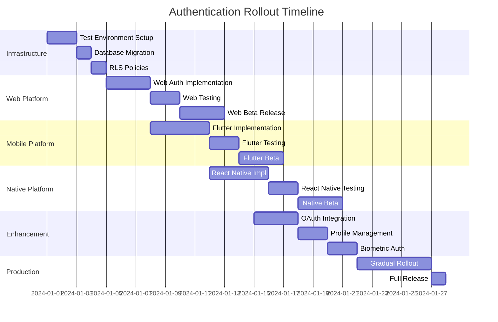

# Migration Strategy

### Phase 2 Rollout Plan

```mermaid
gantt
    title Authentication Rollout Timeline
    dateFormat  YYYY-MM-DD
    section Infrastructure
    Test Environment Setup    :2024-01-01, 2d
    Database Migration        :2024-01-03, 1d
    RLS Policies             :2024-01-04, 1d

    section Web Platform
    Web Auth Implementation   :2024-01-05, 3d
    Web Testing              :2024-01-08, 2d
    Web Beta Release         :2024-01-10, 3d

    section Mobile Platform
    Flutter Implementation    :2024-01-08, 4d
    Flutter Testing          :2024-01-12, 2d
    Flutter Beta            :2024-01-14, 3d

    section Native Platform
    React Native Impl        :2024-01-12, 4d
    React Native Testing     :2024-01-16, 2d
    Native Beta             :2024-01-18, 3d

    section Enhancement
    OAuth Integration        :2024-01-15, 3d
    Profile Management       :2024-01-18, 2d
    Biometric Auth          :2024-01-20, 2d

    section Production
    Gradual Rollout         :2024-01-22, 5d
    Full Release            :2024-01-27, 1d
```

