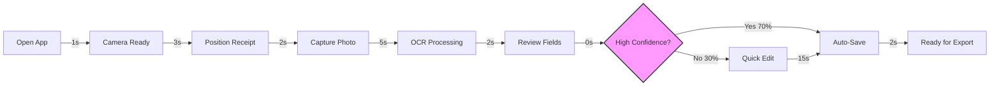
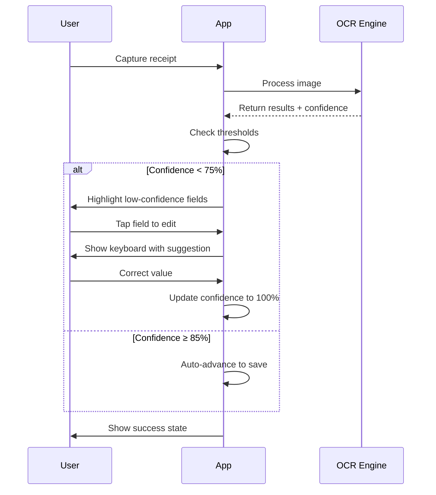
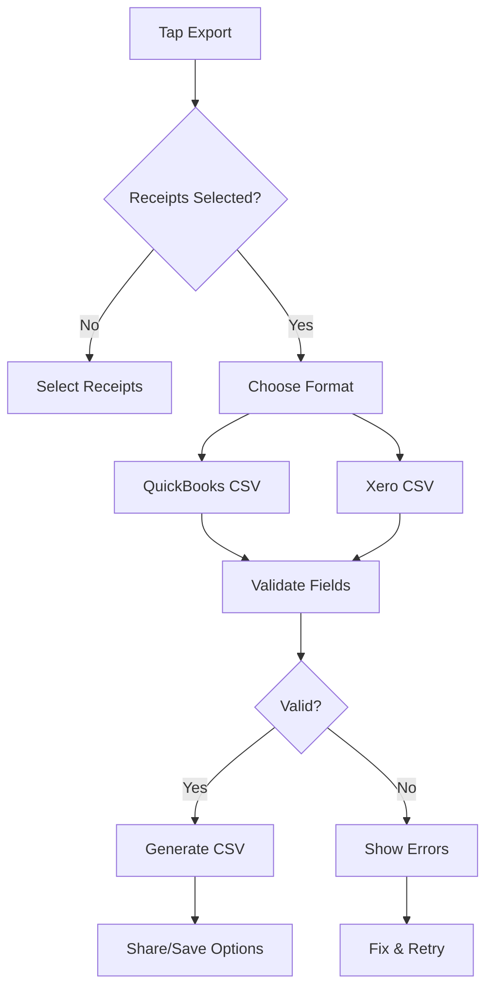

# Receipt Organizer MVP - Front-End UX Specification

**Version:** 1.0  
**Date:** 2025-01-05  
**Status:** Complete  
**Author:** Sally (UX Expert)

---

## 1. Information Architecture

### 1.1 Navigation Model
**Camera-First Mobile Pattern**
- **Primary Entry**: Camera capture as home screen
- **Secondary Access**: Recent receipts list (swipe up from bottom)
- **Tertiary Functions**: Settings/Export via tab bar

### 1.2 Screen Hierarchy

```
Root
├── Camera Capture (Default/Home)
│   ├── Preview & Confirm
│   ├── Quick Edit (4 fields)
│   └── Save Success
├── Receipt List
│   ├── Receipt Detail
│   ├── Batch Select
│   └── Search/Filter
├── Export
│   ├── Format Selection
│   ├── Validation Results
│   └── Download/Share
└── Settings
    ├── OCR Preferences
    ├── Export Templates
    └── Storage Management
```

### 1.3 Data Organization

#### Receipt Object Model
```javascript
{
  id: string,
  capturedAt: timestamp,
  imageUri: string,
  status: 'processing' | 'ready' | 'exported',
  fields: {
    merchant: { value: string, confidence: number },
    date: { value: string, confidence: number },
    total: { value: number, confidence: number },
    tax: { value: number, confidence: number }
  },
  metadata: {
    deviceModel: string,
    appVersion: string,
    processingTime: number
  }
}
```

### 1.4 Content Prioritization
1. **Critical**: Camera button, 4 core fields, Save action
2. **Important**: Confidence indicators, Export button, Recent receipts
3. **Nice-to-have**: Batch operations, Search, Settings

---

## 2. User Flows

### 2.1 Happy Path Flow (≤110 seconds target)



**Total Time Breakdown:**
- Best case (70%): ~15 seconds
- Average case: ~30 seconds with 1-2 corrections
- Worst case: ~110 seconds with all fields requiring edit

### 2.2 Low Confidence Correction Flow



### 2.3 Batch Processing Flow

1. **Capture Mode Activation** (2s)
   - Long-press capture button
   - UI shifts to batch indicator

2. **Rapid Capture** (5s per receipt)
   - Auto-advance after each capture
   - Running count overlay
   - Skip preview for speed

3. **Bulk Review** (30s for 10 receipts)
   - Grid view of all captured
   - Tap any with warning icon
   - Quick-edit inline

4. **Batch Export** (5s)
   - Select all/none/custom
   - Single CSV generation
   - Success confirmation

### 2.4 Export Flow



---

## 3. Wireframes and Mockups

### 3.1 Camera Capture Screen

```
┌─────────────────────────┐
│ ⚡ Receipt Stack    ⚙️ │  <- Status bar
├─────────────────────────┤
│                         │
│   ┌─────────────────┐   │
│   │                 │   │
│   │                 │   │  <- Camera preview
│   │   [Receipt      │   │     with edge detection
│   │    Preview]     │   │     overlay
│   │                 │   │
│   │                 │   │
│   └─────────────────┘   │
│                         │
│  💡 Position receipt    │  <- Helper text
│     within frame        │
│                         │
│        ┌─────┐          │
│        │  📷 │          │  <- Capture button
│        └─────┘          │
│                         │
│  [↑ Recent] [Batch 📦]  │  <- Quick actions
└─────────────────────────┘
```

**shadcn Components Used:**
- `Button` (capture, actions)
- `Card` (camera preview container)
- `Badge` (batch count indicator)
- `Tooltip` (helper text on hover/tap)

### 3.2 Field Review/Edit Screen

```
┌─────────────────────────┐
│ ← Back    Review    ✓   │
├─────────────────────────┤
│  ┌─────────────────┐    │
│  │ [Receipt Image] │    │  <- Thumbnail
│  └─────────────────┘    │
│                         │
│  Merchant               │
│  ┌───────────────────┐  │
│  │ Costco Wholesale  │  │  <- Input field
│  └───────────────────┘  │
│  🟢 95% confidence      │  <- Confidence indicator
│                         │
│  Date                   │
│  ┌───────────────────┐  │
│  │ 2024-12-28       │  │
│  └───────────────────┘  │
│  🟡 78% confidence      │
│                         │
│  Total                  │
│  ┌───────────────────┐  │
│  │ 127.43           │  │
│  └───────────────────┘  │
│  🟢 92% confidence      │
│                         │
│  Tax                    │
│  ┌───────────────────┐  │
│  │ 11.07            │  │
│  └───────────────────┘  │
│  🔴 68% confidence      │
│                         │
│  [🗑️ Delete] [💾 Save]  │
└─────────────────────────┘
```

**shadcn Components Used:**
- `Input` (field editing)
- `Label` (field names)
- `Alert` (low confidence warnings)
- `Progress` (confidence visualization)
- `Button` (actions)

### 3.3 Receipt List Screen

```
┌─────────────────────────┐
│  Receipt Stack          │
│  [Search...] [Filter ▼] │
├─────────────────────────┤
│  Today (3)              │
│  ┌─────────────────┐    │
│  │ 📄 Costco        │   │
│  │ $127.43 • 2:30pm│   │  <- Receipt card
│  │ ✓ Ready         │   │
│  └─────────────────┘    │
│  ┌─────────────────┐    │
│  │ 📄 Starbucks    │   │
│  │ $5.65 • 11:15am │   │
│  │ ⚠️ Review needed│   │
│  └─────────────────┘    │
│                         │
│  Yesterday (5)          │
│  ┌─────────────────┐    │
│  │ 📄 Target       │   │
│  │ $89.23 • 6:45pm│   │
│  │ ✓ Exported      │   │
│  └─────────────────┘    │
│                         │
├─────────────────────────┤
│ [📷] [Select] [Export]  │  <- Bottom actions
└─────────────────────────┘
```

**shadcn Components Used:**
- `Card` (receipt items)
- `ScrollArea` (list container)
- `Separator` (date groups)
- `Checkbox` (multi-select mode)
- `CommandMenu` (search/filter)

### 3.4 Export Screen

```
┌─────────────────────────┐
│     Export Receipts     │
├─────────────────────────┤
│                         │
│  Format                 │
│  ┌─────────────────┐    │
│  │ ◉ QuickBooks   │    │
│  │ ○ Xero         │    │  <- Radio group
│  │ ○ Generic CSV  │    │
│  └─────────────────┘    │
│                         │
│  Date Range             │
│  ┌──────────┬────────┐  │
│  │ From     │ To     │  │  <- Date pickers
│  │ Dec 1    │ Dec 31 │  │
│  └──────────┴────────┘  │
│                         │
│  ✓ 47 receipts selected │
│  ⚠️ 3 missing merchant  │  <- Validation
│                         │
│  Preview:               │
│  ┌─────────────────┐    │
│  │ Date,Merchant... │   │  <- CSV preview
│  │ 12/28,Costco... │   │
│  │ 12/27,Target... │   │
│  └─────────────────┘    │
│                         │
│  [Cancel] [Export CSV]  │
└─────────────────────────┘
```

**shadcn Components Used:**
- `RadioGroup` (format selection)
- `Calendar` / `DatePicker` (date range)
- `Alert` (validation warnings)
- `Table` (CSV preview)
- `Dialog` (export modal)

---

## 4. Component Library / Design System

### 4.1 Design System Approach

**Foundation**: shadcn/ui component library
- **Why**: Production-ready, accessible, customizable, React/TypeScript native
- **Extensions**: Receipt-specific components built on shadcn primitives
- **Theming**: CSS variables for brand colors while maintaining shadcn structure

### 4.2 Core Components

#### Receipt Capture Button
- **Base**: shadcn `Button` variant="default" size="lg"
- **Purpose**: Primary capture action
- **States**: Idle, Pressed, Processing, Success, Error
- **Variants**: Single capture, Batch mode (long-press activated)

#### Confidence Indicator
- **Base**: Combination of shadcn `Progress` + `Badge`
- **Purpose**: Show OCR confidence visually
- **States**: High (≥85%, green), Medium (75-84%, yellow), Low (<75%, red)
- **Usage**: Appears below each field, updates in real-time

#### Field Input
- **Base**: shadcn `Input` with custom validation
- **Purpose**: Edit extracted receipt data
- **States**: Default, Focus, Error, Success, Disabled
- **Features**: Auto-format for currency/date, inline validation

#### Receipt Card
- **Base**: shadcn `Card` with structured content
- **Purpose**: Display receipt summary in lists
- **Variants**: Compact (list view), Expanded (detail view), Skeleton (loading)
- **Actions**: Swipe-to-delete, Tap-to-edit, Long-press-to-select

#### Export Platform Selector
- **Base**: shadcn `Select` or `RadioGroup`
- **Purpose**: Choose export format
- **Options**: QuickBooks, Xero, Generic CSV, More (disabled for v1)
- **Behavior**: Updates preview on selection

#### Batch Progress Indicator
- **Base**: shadcn `Progress` with label overlay
- **Purpose**: Show batch processing status
- **Features**: Current/Total count, Time estimate, Cancel option

---

## 5. Branding & Style Guide

### 5.1 Visual Identity

#### Brand Personality
**Target Perception**: Professional efficiency meets approachable simplicity
- **Core Attributes**: Trustworthy, Efficient, Clear, Helpful
- **Anti-patterns**: Corporate stiffness, Tech complexity, Accounting jargon
- **Voice**: Direct problem-solver ("Captured", "Ready", "Done") not verbose assistant

#### Logo & Application Identity
**App Name**: "Receipt Stack" (working title)
- **Icon Design**: Stacked receipt papers with checkmark overlay
- **Color Usage**: Primary brand color in checkmark, neutral receipt representation
- **Platform Variants**: 
  - iOS: Rounded rectangle with 28% corner radius
  - Android: Adaptive icon with foreground/background layers

### 5.2 Color System

#### Primary Palette (shadcn/ui aligned)
```css
/* Light Mode - Based on shadcn zinc theme */
--primary: hsl(222.2 47.4% 11.2%);         /* Deep blue-black for primary actions */
--primary-foreground: hsl(210 40% 98%);    /* White text on primary */
--success: hsl(142 76% 36%);               /* Green for successful capture */
--warning: hsl(38 92% 50%);                /* Amber for low confidence */
--destructive: hsl(0 84.2% 60.2%);         /* Red for errors/deletion */
--muted: hsl(210 40% 96.1%);               /* Soft backgrounds */
--accent: hsl(210 40% 90%);                /* Subtle highlights */

/* Dark Mode */
--primary: hsl(210 40% 98%);               /* Light text in dark mode */
--background: hsl(222.2 84% 4.9%);         /* Near black background */
--card: hsl(222.2 84% 8%);                 /* Elevated surfaces */
```

#### Semantic Colors for Receipt States
- **Capture Ready**: `--primary` with 100% opacity
- **Processing**: `--warning` with animated pulse
- **High Confidence (>85%)**: `--success` indicator
- **Low Confidence (<75%)**: `--warning` indicator  
- **Manual Review Required**: `--destructive` border accent

### 5.3 Typography

#### Font Stack (System-Optimized)
```css
--font-sans: -apple-system, BlinkMacSystemFont, "Segoe UI", Roboto, 
             "Helvetica Neue", Arial, sans-serif;
--font-mono: "SF Mono", Monaco, "Cascadia Code", "Roboto Mono", monospace;
```

#### Type Scale (shadcn/ui defaults)
- **Display**: 2.25rem (36px) - Batch totals only
- **Heading**: 1.875rem (30px) - Section headers
- **Title**: 1.5rem (24px) - Card headers
- **Body**: 1rem (16px) - Primary content
- **Small**: 0.875rem (14px) - Metadata, timestamps
- **Caption**: 0.75rem (12px) - Help text, confidence scores

#### Receipt-Specific Typography Rules
- **Extracted Values**: `--font-mono` for amounts and dates
- **Confidence Scores**: `--font-sans` small size with muted color
- **Field Labels**: Medium weight, uppercase, 0.05em letter-spacing
- **Error Messages**: Regular weight, `--destructive` color

### 5.4 Spacing & Layout Grid

#### Base Unit System
- **Base**: 4px grid system
- **Spacing Scale**: 4, 8, 12, 16, 24, 32, 48, 64px
- **Touch Targets**: Minimum 44x44px (iOS) / 48x48px (Android)

#### Receipt Card Spacing
```css
.receipt-card {
  padding: var(--space-4);        /* 16px internal padding */
  margin-bottom: var(--space-3);  /* 12px between cards */
  border-radius: var(--radius);   /* 8px standard radius */
}

.field-group {
  gap: var(--space-2);             /* 8px between fields */
  padding: var(--space-3);         /* 12px group padding */
}
```

### 5.5 Visual Effects & Animations

#### Motion Principles
- **Duration**: 150-300ms for micro-interactions
- **Easing**: `cubic-bezier(0.4, 0, 0.2, 1)` (shadcn default)
- **Reduced Motion**: Respect `prefers-reduced-motion`

#### Receipt-Specific Animations
```css
/* Capture button press */
@keyframes capture-pulse {
  0% { transform: scale(1); }
  50% { transform: scale(0.95); opacity: 0.8; }
  100% { transform: scale(1); }
}

/* Processing indicator */
@keyframes processing-sweep {
  0% { transform: translateY(0); opacity: 0; }
  50% { opacity: 1; }
  100% { transform: translateY(100%); opacity: 0; }
}

/* Confidence update */
.confidence-transition {
  transition: background-color 200ms ease-in-out,
              border-color 200ms ease-in-out;
}
```

### 5.6 Iconography

#### Icon Library
**Primary**: Lucide React (shadcn/ui default)
- Consistent 24x24px base size
- 1.5px stroke width
- Rounded line caps and joins

#### Receipt-Specific Icons
- **Camera**: `<Camera />` - Receipt capture
- **Check**: `<Check />` - High confidence/validated
- **AlertCircle**: `<AlertCircle />` - Low confidence
- **Edit**: `<Edit3 />` - Manual correction
- **Download**: `<Download />` - CSV export
- **Trash**: `<Trash2 />` - Delete receipt
- **ChevronRight**: `<ChevronRight />` - Navigation/next
- **Upload**: `<Upload />` - Batch processing
- **FileText**: `<FileText />` - Receipt placeholder

### 5.7 Platform-Specific Adaptations

#### iOS Considerations
- Safe area insets for notch/Dynamic Island
- Haptic feedback on capture (UIImpactFeedbackGenerator)
- San Francisco font metrics optimization
- Bottom sheet presentation for exports

#### Android Considerations
- Material You dynamic color support (Android 12+)
- Edge-to-edge display with system bar coordination
- Back gesture handling for form navigation
- FAB positioning for primary capture action

### 5.8 Accessibility Color Compliance

#### WCAG 2.1 AA Targets
- **Text Contrast**: 4.5:1 minimum (7:1 for small text)
- **UI Elements**: 3:1 minimum contrast
- **Focus Indicators**: 2px solid outline with 3:1 contrast

#### Color Blind Considerations
- Never rely solely on color for status (add icons/patterns)
- Test with deuteranopia/protanopia simulators
- Confidence scores include percentage text, not just color

### 5.9 Design Token Implementation

```typescript
// tokens/receipt-tokens.ts
export const receiptTokens = {
  // Confidence thresholds
  confidence: {
    high: { min: 85, color: 'hsl(142 76% 36%)' },
    medium: { min: 75, color: 'hsl(38 92% 50%)' },
    low: { max: 74, color: 'hsl(0 84.2% 60.2%)' }
  },
  
  // Receipt-specific spacing
  receipt: {
    card: { padding: '16px', gap: '12px' },
    field: { height: '44px', padding: '12px' },
    image: { maxHeight: '200px', borderRadius: '8px' }
  },
  
  // Animation timings
  animation: {
    capture: '300ms cubic-bezier(0.4, 0, 0.2, 1)',
    confidence: '200ms ease-in-out',
    processing: '1.5s linear infinite'
  }
};
```

---

## 6. Accessibility

### 6.1 WCAG 2.1 Level AA Compliance

#### Core Requirements
- **Perceivable**: All receipt data visible with proper contrast and alternative formats
- **Operable**: Full keyboard navigation and touch gesture alternatives
- **Understandable**: Clear labeling and predictable receipt processing behavior
- **Robust**: Compatible with screen readers and assistive technologies

### 6.2 Screen Reader Support

#### Platform Integration
- **iOS**: Full VoiceOver support with custom rotor actions
- **Android**: TalkBack optimization with content descriptions

#### Receipt-Specific Announcements
```typescript
// Accessibility labels for receipt states
const a11yLabels = {
  captureButton: "Capture receipt photo",
  captureSuccess: "Receipt captured successfully, processing",
  ocrComplete: (confidence: number) => 
    `Processing complete. Overall confidence ${confidence}%. Swipe to review fields.`,
  fieldValue: (field: string, value: string, confidence: number) =>
    `${field}: ${value}. Confidence ${confidence}%. Double tap to edit.`,
  lowConfidence: "Low confidence. Manual review recommended.",
  exportReady: (count: number) => 
    `${count} receipts ready for export. Double tap to download CSV.`
};
```

### 6.3 Keyboard Navigation

#### Tab Order Sequence
1. Skip to main content link
2. Capture receipt button (primary action)
3. Recent receipts list (if any)
4. Each receipt card's fields in order: Merchant → Date → Total → Tax
5. Edit buttons for each field
6. Save/Delete actions per receipt
7. Batch actions toolbar
8. Export button

#### Keyboard Shortcuts
- `Space/Enter`: Activate focused button
- `Tab/Shift+Tab`: Navigate between fields
- `Escape`: Cancel editing/close modals
- `Cmd/Ctrl + S`: Save current receipt
- `Cmd/Ctrl + E`: Export batch

### 6.4 Touch Accessibility

#### Gesture Support
- **Single Tap**: Select/Focus element
- **Double Tap**: Activate when using screen reader
- **Two-Finger Swipe**: Scroll through receipt list
- **Three-Finger Swipe**: Navigate between screens
- **Long Press**: Show context menu with actions

#### Touch Target Guidelines
```css
.touch-target {
  min-width: 44px;  /* iOS Human Interface Guidelines */
  min-height: 44px;
  padding: 12px;    /* Increase tappable area beyond visual bounds */
}

/* Android specific */
@media (hover: none) and (pointer: coarse) {
  .touch-target {
    min-width: 48px;  /* Material Design Guidelines */
    min-height: 48px;
  }
}
```

### 6.5 Visual Accessibility

#### High Contrast Mode
```css
@media (prefers-contrast: high) {
  .receipt-card {
    border: 2px solid var(--foreground);
    box-shadow: none;
  }
  
  .confidence-indicator {
    font-weight: bold;
    text-decoration: underline;
  }
}
```

#### Focus Indicators
```css
:focus-visible {
  outline: 2px solid var(--primary);
  outline-offset: 2px;
  border-radius: var(--radius);
}

/* High contrast focus */
@media (prefers-contrast: high) {
  :focus-visible {
    outline-width: 3px;
    outline-color: currentColor;
  }
}
```

### 6.6 Motion Accessibility

#### Reduced Motion Support
```css
@media (prefers-reduced-motion: reduce) {
  * {
    animation-duration: 0.01ms !important;
    animation-iteration-count: 1 !important;
    transition-duration: 0.01ms !important;
  }
  
  /* Maintain functional animations with instant feedback */
  .processing-indicator {
    animation: none;
    opacity: 1;
  }
}
```

### 6.7 Cognitive Accessibility

#### Simplified Language
- Use plain language: "Take Photo" not "Initiate Capture Sequence"
- Consistent terminology: Always "receipt" not "document/invoice/bill"
- Clear error messages: "Camera access needed" not "Permission denied: CAM_001"

#### Progressive Disclosure
- Show only 4 core fields initially
- Hide advanced options behind "More" button
- Batch operations appear only after 2+ receipts captured

### 6.8 Form Accessibility

#### Field Labels and Errors
```html
<!-- Accessible form field structure -->
<div class="field-group" role="group" aria-labelledby="merchant-label">
  <label id="merchant-label" for="merchant-input">
    Merchant Name
    <span class="confidence" aria-live="polite">
      85% confidence
    </span>
  </label>
  <input 
    id="merchant-input"
    type="text"
    value="Costco Wholesale"
    aria-describedby="merchant-error merchant-help"
    aria-invalid="false"
  />
  <span id="merchant-help" class="help-text">
    Business or store name
  </span>
  <span id="merchant-error" class="error-text" role="alert" hidden>
    Merchant name is required
  </span>
</div>
```

### 6.9 Error Prevention & Recovery

#### Confirmation Dialogs
```typescript
// Destructive action confirmation
const deleteConfirmation = {
  title: "Delete Receipt?",
  message: "This will permanently remove the receipt. This cannot be undone.",
  cancel: "Keep Receipt",
  confirm: "Delete",
  ariaLabel: "Confirm receipt deletion"
};
```

#### Auto-Save Indicators
- Visual: Checkmark animation after field edit
- Screen reader: "Changes saved" announcement
- Haptic: Light feedback on iOS after save

### 6.10 Testing Checklist

#### Automated Testing
- [ ] axe-core integration for accessibility violations
- [ ] WAVE tool validation
- [ ] Lighthouse accessibility score ≥95
- [ ] Color contrast analyzer passing

#### Manual Testing
- [ ] Full keyboard-only navigation flow
- [ ] Screen reader testing (VoiceOver/TalkBack)
- [ ] 200% zoom without horizontal scroll
- [ ] High contrast mode validation
- [ ] Reduced motion preference respected

---

## 7. Responsiveness & Adaptability

### 7.1 Device-First Breakpoint Strategy

#### Mobile-Only Breakpoints (No Desktop in MVP)
```css
/* Base: iPhone SE/12 Mini (375px) */
@media (min-width: 375px) { }

/* Medium: iPhone 14/15 Standard (390px) */
@media (min-width: 390px) { }

/* Large: iPhone Plus/Max & Android Flagships (428px) */
@media (min-width: 428px) { }

/* Tablet Portrait - Future consideration only */
@media (min-width: 768px) { 
  /* Graceful scaling, not optimized */
}
```

### 7.2 Viewport Configurations

#### Safe Area Handling
```css
.app-container {
  /* Account for notches and system UI */
  padding-top: env(safe-area-inset-top);
  padding-bottom: env(safe-area-inset-bottom);
  padding-left: env(safe-area-inset-left);
  padding-right: env(safe-area-inset-right);
}

/* iOS specific viewport */
<meta name="viewport" content="width=device-width, initial-scale=1, maximum-scale=1, viewport-fit=cover">
```

### 7.3 Orientation Handling

#### Portrait-First Design
```css
/* Portrait (Default) */
.receipt-capture {
  height: calc(100vh - env(safe-area-inset-top) - 120px);
  display: flex;
  flex-direction: column;
}

/* Landscape (Basic Support) */
@media (orientation: landscape) {
  .receipt-capture {
    flex-direction: row;
    height: calc(100vh - env(safe-area-inset-top) - 60px);
  }
  
  .capture-preview {
    max-width: 50%;
  }
  
  /* Hide less critical elements */
  .batch-summary { display: none; }
}
```

### 7.4 Dynamic Type Support

#### iOS Dynamic Type
```css
/* Support iOS Dynamic Type scaling */
.field-label {
  font: -apple-system-body;
}

.field-value {
  font: -apple-system-headline;
}

/* Constrain maximum scaling for layout stability */
@supports (font: -apple-system-body) {
  .receipt-card {
    max-height: none; /* Allow expansion */
    min-height: 120px;
  }
}
```

#### Android Font Scaling
```css
/* Respect Android system font size */
html {
  font-size: 100%; /* Base 16px */
}

/* Use rem units for scalability */
.body-text {
  font-size: 1rem; /* Scales with system */
  line-height: 1.5;
}
```

### 7.5 Component Adaptations

#### Receipt Card Responsive Behavior
```typescript
// Responsive receipt card layout
const ReceiptCardResponsive = {
  // iPhone SE (375px)
  small: {
    padding: '12px',
    imageHeight: '160px',
    fontSize: '14px',
    buttonSize: '36px'
  },
  
  // iPhone 14 (390px)
  medium: {
    padding: '16px',
    imageHeight: '180px',
    fontSize: '16px',
    buttonSize: '40px'
  },
  
  // iPhone Plus/Android (428px+)
  large: {
    padding: '20px',
    imageHeight: '200px',
    fontSize: '16px',
    buttonSize: '44px'
  }
};
```

#### Bottom Sheet Adaptations
```css
.bottom-sheet {
  /* Small devices: Full height */
  height: calc(100vh - env(safe-area-inset-top));
}

@media (min-width: 428px) and (min-height: 800px) {
  .bottom-sheet {
    /* Larger devices: Partial height */
    height: 70vh;
    max-height: 600px;
    border-radius: 16px 16px 0 0;
  }
}
```

### 7.6 Touch Target Scaling

#### Responsive Touch Targets
```css
.touch-button {
  /* Minimum viable target */
  min-width: 44px;
  min-height: 44px;
  padding: 8px 12px;
}

/* Larger screens get more comfortable targets */
@media (min-width: 428px) {
  .touch-button {
    min-width: 48px;
    min-height: 48px;
    padding: 12px 16px;
  }
}

/* Accessibility mode */
@media (prefers-reduced-motion: reduce) {
  .touch-button {
    /* Even larger targets for users with motor impairments */
    min-width: 56px;
    min-height: 56px;
  }
}
```

### 7.7 Image Handling

#### Responsive Image Loading
```typescript
// Adaptive image quality based on device
const getImageQuality = (screenWidth: number): number => {
  if (screenWidth <= 375) return 0.7;  // iPhone SE
  if (screenWidth <= 390) return 0.8;  // iPhone 14
  return 0.9;  // Larger devices
};

// Maximum dimensions by device
const getMaxImageSize = (screenWidth: number) => ({
  width: screenWidth <= 375 ? 1200 : 1600,
  height: screenWidth <= 375 ? 1600 : 2000
});
```

### 7.8 Network Adaptation

#### Connection-Aware Features
```typescript
// Adjust behavior based on network
const getNetworkStrategy = () => {
  const connection = navigator.connection;
  
  if (!connection) return 'default';
  
  if (connection.saveData) {
    return {
      imageQuality: 0.6,
      skipAnimations: true,
      batchSize: 5
    };
  }
  
  if (connection.effectiveType === '4g') {
    return {
      imageQuality: 0.9,
      skipAnimations: false,
      batchSize: 20
    };
  }
  
  // 3G or slower
  return {
    imageQuality: 0.7,
    skipAnimations: true,
    batchSize: 10
  };
};
```

### 7.9 Platform-Specific Adjustments

#### iOS Adaptations
```css
/* iOS bounce scroll for natural feel */
.receipt-list {
  -webkit-overflow-scrolling: touch;
  overscroll-behavior-y: contain;
}

/* iOS status bar spacing */
.ios-device .header {
  padding-top: 44px; /* Account for status bar */
}

/* Notch/Dynamic Island handling */
.ios-device.has-notch .header {
  padding-top: 59px; /* Larger safe area */
}
```

#### Android Adaptations
```css
/* Android system navigation */
.android-device {
  /* Account for navigation bar */
  padding-bottom: 48px;
}

/* Android gesture navigation */
.android-device.gesture-nav {
  padding-bottom: 24px; /* Smaller bar */
}

/* Material Design ripple */
.android-device .touch-button::after {
  content: '';
  position: absolute;
  /* Ripple effect implementation */
}
```

### 7.10 Performance Budgets by Device

#### Resource Constraints
```typescript
const performanceBudgets = {
  // Older devices (iPhone 12, Pixel 5)
  low: {
    maxMemoryMB: 50,
    maxConcurrentImages: 3,
    animationFPS: 30,
    imageProcessingDelay: 100
  },
  
  // Target devices (iPhone 14, S22)
  medium: {
    maxMemoryMB: 75,
    maxConcurrentImages: 5,
    animationFPS: 60,
    imageProcessingDelay: 50
  },
  
  // Newer devices (iPhone 15 Pro, S24)
  high: {
    maxMemoryMB: 100,
    maxConcurrentImages: 10,
    animationFPS: 120,
    imageProcessingDelay: 0
  }
};
```

---

## 8. Animations and Interactions

### 8.1 Motion Design Principles

#### Core Philosophy
- **Purposeful**: Every animation serves a functional purpose
- **Responsive**: Immediate feedback for all user actions
- **Subtle**: Enhance without distracting from receipt processing
- **Performant**: 60fps minimum, no janky animations

### 8.2 Micro-Interactions

#### Capture Button States
```css
/* Idle state - subtle breathing effect */
@keyframes capture-breathe {
  0%, 100% { transform: scale(1); opacity: 0.9; }
  50% { transform: scale(1.02); opacity: 1; }
}

.capture-button {
  animation: capture-breathe 3s ease-in-out infinite;
}

/* Press state - tactile feedback */
.capture-button:active {
  animation: none;
  transform: scale(0.95);
  transition: transform 100ms cubic-bezier(0.4, 0, 0.2, 1);
}

/* Success state - confirmation pulse */
@keyframes capture-success {
  0% { transform: scale(1); }
  40% { transform: scale(1.15); }
  100% { transform: scale(1); }
}

.capture-button.success {
  animation: capture-success 400ms cubic-bezier(0.68, -0.55, 0.265, 1.55);
}
```

#### Confidence Score Updates
```typescript
// Animated confidence score with easing
const animateConfidence = (
  element: HTMLElement,
  from: number,
  to: number,
  duration: number = 300
) => {
  const startTime = performance.now();
  const diff = to - from;
  
  const animate = (currentTime: number) => {
    const elapsed = currentTime - startTime;
    const progress = Math.min(elapsed / duration, 1);
    
    // Ease-out-cubic for natural deceleration
    const eased = 1 - Math.pow(1 - progress, 3);
    const value = from + (diff * eased);
    
    element.textContent = `${Math.round(value)}%`;
    element.style.setProperty('--confidence', value);
    
    if (progress < 1) {
      requestAnimationFrame(animate);
    }
  };
  
  requestAnimationFrame(animate);
};
```

### 8.3 Receipt Processing Animations

#### OCR Scanning Effect
```css
/* Scanning line animation */
@keyframes scan-sweep {
  0% {
    transform: translateY(-100%);
    opacity: 0;
  }
  10% {
    opacity: 1;
  }
  90% {
    opacity: 1;
  }
  100% {
    transform: translateY(100%);
    opacity: 0;
  }
}

.scanning-overlay {
  position: absolute;
  width: 100%;
  height: 2px;
  background: linear-gradient(
    90deg,
    transparent,
    var(--primary),
    transparent
  );
  animation: scan-sweep 2s ease-in-out infinite;
}

/* Field extraction highlight */
@keyframes field-extract {
  0% {
    background-color: transparent;
  }
  50% {
    background-color: var(--accent);
  }
  100% {
    background-color: transparent;
  }
}

.field-extracting {
  animation: field-extract 600ms ease-in-out;
}
```

### 8.4 Page Transitions

#### Navigation Animations
```css
/* Slide transitions between screens */
.screen-enter {
  transform: translateX(100%);
  opacity: 0;
}

.screen-enter-active {
  transform: translateX(0);
  opacity: 1;
  transition: transform 300ms cubic-bezier(0.4, 0, 0.2, 1),
              opacity 200ms ease-out;
}

.screen-exit {
  transform: translateX(0);
  opacity: 1;
}

.screen-exit-active {
  transform: translateX(-20%);
  opacity: 0;
  transition: transform 300ms cubic-bezier(0.4, 0, 0.2, 1),
              opacity 200ms ease-in;
}
```

### 8.5 Gesture Interactions

#### Swipe Actions
```typescript
// Swipe to delete with spring physics
const swipeToDelete = {
  threshold: 80, // pixels
  velocity: 0.3, // pixels/ms
  rubberBand: (distance: number, dimension: number) => {
    return (1 - (1 / ((distance * 0.55 / dimension) + 1))) * dimension;
  },
  spring: {
    tension: 200,
    friction: 25,
    precision: 0.001
  }
};

// Pinch to zoom receipt image
const pinchZoom = {
  minScale: 1,
  maxScale: 3,
  doubleTapScale: 2,
  animationDuration: 250
};
```

### 8.6 Loading States

#### Skeleton Screens
```css
/* Animated skeleton for receipt cards */
@keyframes skeleton-pulse {
  0% {
    background-position: -200% 0;
  }
  100% {
    background-position: 200% 0;
  }
}

.skeleton-item {
  background: linear-gradient(
    90deg,
    var(--muted) 25%,
    var(--accent) 50%,
    var(--muted) 75%
  );
  background-size: 200% 100%;
  animation: skeleton-pulse 1.5s ease-in-out infinite;
  border-radius: var(--radius);
}
```

#### Progress Indicators
```typescript
// Batch processing progress with easing
const batchProgress = {
  update: (current: number, total: number) => {
    const percentage = (current / total) * 100;
    const duration = 300; // ms per item
    
    return {
      width: `${percentage}%`,
      transition: `width ${duration}ms cubic-bezier(0.4, 0, 0.2, 1)`,
      label: `Processing ${current} of ${total}`
    };
  }
};
```

### 8.7 Haptic Feedback (iOS)

#### Feedback Patterns
```typescript
// Haptic feedback mapping
const hapticFeedback = {
  // Light - selection changed
  selection: () => {
    if ('vibrate' in navigator) {
      navigator.vibrate(10);
    }
  },
  
  // Medium - action confirmed
  success: () => {
    if (window.webkit?.messageHandlers?.haptic) {
      window.webkit.messageHandlers.haptic.postMessage('impact.medium');
    }
  },
  
  // Heavy - error or deletion
  warning: () => {
    if (window.webkit?.messageHandlers?.haptic) {
      window.webkit.messageHandlers.haptic.postMessage('impact.heavy');
    }
  }
};
```

### 8.8 Scroll Interactions

#### Pull-to-Refresh
```css
/* Elastic pull-to-refresh */
.pull-to-refresh {
  transform: translateY(var(--pull-distance));
  transition: transform 200ms cubic-bezier(0.4, 0, 0.2, 1);
}

.pull-indicator {
  opacity: calc(var(--pull-distance) / 100);
  transform: rotate(calc(var(--pull-distance) * 3.6deg));
}

/* Refresh animation */
@keyframes refresh-spin {
  from { transform: rotate(0deg); }
  to { transform: rotate(360deg); }
}

.refreshing .pull-indicator {
  animation: refresh-spin 1s linear infinite;
}
```

### 8.9 Error States

#### Shake Animation for Validation
```css
@keyframes error-shake {
  0%, 100% { transform: translateX(0); }
  10%, 30%, 50%, 70%, 90% { transform: translateX(-4px); }
  20%, 40%, 60%, 80% { transform: translateX(4px); }
}

.field-error {
  animation: error-shake 400ms ease-in-out;
  border-color: var(--destructive);
}

/* Error message slide-in */
.error-message {
  animation: slide-down 200ms cubic-bezier(0.4, 0, 0.2, 1);
  transform-origin: top;
}

@keyframes slide-down {
  from {
    opacity: 0;
    transform: scaleY(0);
  }
  to {
    opacity: 1;
    transform: scaleY(1);
  }
}
```

### 8.10 Performance Optimization

#### Animation Performance Rules
```typescript
// Performance monitoring
const animationPerformance = {
  // Use transform/opacity only for 60fps
  allowedProperties: ['transform', 'opacity'],
  
  // Disable animations on low-end devices
  shouldAnimate: () => {
    const fps = performance.now();
    const memoryMB = performance.memory?.usedJSHeapSize / 1048576;
    
    return fps > 50 && memoryMB < 100;
  },
  
  // Reduce motion for accessibility
  reduceMotion: window.matchMedia('(prefers-reduced-motion: reduce)').matches,
  
  // Use will-change sparingly
  prepareAnimation: (element: HTMLElement) => {
    element.style.willChange = 'transform';
    setTimeout(() => {
      element.style.willChange = 'auto';
    }, 500);
  }
};
```

#### GPU Acceleration
```css
/* Force GPU acceleration for smooth animations */
.gpu-accelerated {
  transform: translateZ(0);
  will-change: transform;
  backface-visibility: hidden;
  perspective: 1000px;
}

/* Clean up after animation */
.animation-complete {
  will-change: auto;
  transform: none;
}
```

---

## 9. Performance

### 9.1 Performance Budgets

#### Core Web Vitals Targets
```typescript
const performanceTargets = {
  // Largest Contentful Paint (camera view ready)
  LCP: {
    target: 1500, // 1.5s
    max: 2500     // 2.5s
  },
  
  // First Input Delay (capture button responsive)
  FID: {
    target: 50,   // 50ms
    max: 100      // 100ms
  },
  
  // Cumulative Layout Shift (stable UI)
  CLS: {
    target: 0.05, // 0.05
    max: 0.1      // 0.1
  },
  
  // Time to Interactive (app fully responsive)
  TTI: {
    target: 2000, // 2s
    max: 3500     // 3.5s
  }
};
```

### 9.2 Resource Loading Strategy

#### Critical Path Optimization
```typescript
// Resource loading priorities
const resourcePriorities = {
  critical: [
    'camera-api.js',      // Core functionality
    'capture-button.css', // Above-the-fold styles
    'ml-kit-loader.js'    // OCR engine
  ],
  
  high: [
    'receipt-card.js',    // Primary UI component
    'field-editor.js',    // User interaction
    'validation.js'       // Data integrity
  ],
  
  low: [
    'export-csv.js',      // Deferred until needed
    'animations.css',     // Enhancement only
    'analytics.js'        // Non-critical tracking
  ]
};

// Lazy loading strategy
const lazyLoad = {
  images: 'IntersectionObserver',
  components: 'Dynamic imports',
  routes: 'Code splitting'
};
```

### 9.3 Memory Management

#### Memory Constraints
```typescript
const memoryLimits = {
  // Maximum memory usage per device tier
  lowEnd: {
    maxHeapMB: 50,
    maxImagesMB: 20,
    maxCacheMB: 10
  },
  
  midRange: {
    maxHeapMB: 75,
    maxImagesMB: 35,
    maxCacheMB: 20
  },
  
  highEnd: {
    maxHeapMB: 100,
    maxImagesMB: 50,
    maxCacheMB: 30
  }
};

// Image memory optimization
class ImageMemoryManager {
  private activeImages = new Map();
  private maxMemoryMB = 35;
  
  loadImage(url: string, priority: 'high' | 'low') {
    if (this.getCurrentMemoryMB() > this.maxMemoryMB * 0.8) {
      this.evictLowPriorityImages();
    }
    
    // Downscale if needed
    const quality = this.getQualityForMemory();
    return this.loadWithQuality(url, quality);
  }
  
  private evictLowPriorityImages() {
    // Remove oldest low-priority images
    const sorted = Array.from(this.activeImages.entries())
      .filter(([_, meta]) => meta.priority === 'low')
      .sort((a, b) => a[1].timestamp - b[1].timestamp);
    
    for (const [url] of sorted.slice(0, 3)) {
      this.unloadImage(url);
    }
  }
}
```

### 9.4 Network Optimization

#### API Call Batching
```typescript
// Batch API requests to reduce overhead
class APIBatcher {
  private queue: Map<string, Promise<any>> = new Map();
  private batchTimer: number | null = null;
  private batchDelay = 50; // ms
  
  async batchRequest(endpoint: string, data: any) {
    if (!this.batchTimer) {
      this.batchTimer = setTimeout(() => this.flush(), this.batchDelay);
    }
    
    return new Promise((resolve) => {
      this.queue.set(endpoint, { data, resolve });
    });
  }
  
  private async flush() {
    if (this.queue.size === 0) return;
    
    const batch = Array.from(this.queue.entries());
    this.queue.clear();
    this.batchTimer = null;
    
    // Send batched request
    const results = await fetch('/api/batch', {
      method: 'POST',
      body: JSON.stringify(batch)
    });
    
    // Resolve individual promises
    batch.forEach(([_, { resolve }], index) => {
      resolve(results[index]);
    });
  }
}
```

### 9.5 Rendering Performance

#### Virtual Scrolling for Receipt Lists
```typescript
// Virtual scroll implementation for large lists
class VirtualScroller {
  private itemHeight = 120; // Receipt card height
  private visibleCount = 8; // Visible items
  private buffer = 2; // Off-screen buffer
  
  getVisibleItems(scrollTop: number, items: Receipt[]) {
    const startIndex = Math.floor(scrollTop / this.itemHeight);
    const endIndex = startIndex + this.visibleCount + this.buffer;
    
    return {
      items: items.slice(
        Math.max(0, startIndex - this.buffer),
        Math.min(items.length, endIndex)
      ),
      offsetY: startIndex * this.itemHeight,
      totalHeight: items.length * this.itemHeight
    };
  }
}
```

#### Frame Rate Optimization
```css
/* Use CSS containment for performance */
.receipt-card {
  contain: layout style paint;
}

/* Optimize repaints */
.receipt-list {
  will-change: scroll-position;
}

/* Reduce paint areas */
.confidence-indicator {
  /* Isolate frequent updates */
  will-change: contents;
  contain: paint;
}
```

### 9.6 OCR Processing Optimization

#### Progressive Enhancement
```typescript
// Multi-stage OCR processing
const ocrPipeline = {
  // Stage 1: Quick preview (100ms)
  quickScan: async (image: Blob) => {
    const lowRes = await downscale(image, 0.3);
    return await mlKit.quickDetect(lowRes);
  },
  
  // Stage 2: Field extraction (500ms)
  extractFields: async (image: Blob, regions: Region[]) => {
    const crops = regions.map(r => cropRegion(image, r));
    return await Promise.all(
      crops.map(crop => mlKit.recognize(crop))
    );
  },
  
  // Stage 3: Confidence validation (200ms)
  validateConfidence: (results: OCRResult[]) => {
    return results.map(r => ({
      ...r,
      confidence: calculateConfidence(r),
      needsReview: r.confidence < 0.75
    }));
  }
};
```

### 9.7 Bundle Size Optimization

#### Code Splitting Strategy
```typescript
// Route-based code splitting
const routes = {
  capture: () => import('./views/Capture'),
  review: () => import('./views/Review'),
  export: () => import('./views/Export')
};

// Component-level splitting
const HeavyComponents = {
  CSVExporter: () => import('./components/CSVExporter'),
  BatchProcessor: () => import('./components/BatchProcessor'),
  AdvancedSettings: () => import('./components/AdvancedSettings')
};
```

#### Tree Shaking Configuration
```javascript
// webpack.config.js
module.exports = {
  optimization: {
    usedExports: true,
    sideEffects: false,
    splitChunks: {
      chunks: 'all',
      cacheGroups: {
        vendor: {
          test: /[\\/]node_modules[\\/]/,
          priority: 10,
          reuseExistingChunk: true
        },
        common: {
          minChunks: 2,
          priority: 5,
          reuseExistingChunk: true
        }
      }
    }
  }
};
```

### 9.8 Caching Strategy

#### Multi-Layer Cache
```typescript
// Cache hierarchy
const cacheStrategy = {
  // L1: Memory cache (instant)
  memory: new Map(),
  
  // L2: IndexedDB (fast)
  local: {
    receipts: 'idb:receipts',
    images: 'idb:images',
    exports: 'idb:exports'
  },
  
  // L3: Service Worker (offline)
  serviceWorker: {
    strategy: 'CacheFirst',
    maxAge: 86400, // 24 hours
    maxEntries: 100
  }
};

// Smart cache invalidation
class CacheManager {
  async get(key: string) {
    // Check memory first
    if (this.memory.has(key)) {
      return this.memory.get(key);
    }
    
    // Check IndexedDB
    const local = await idb.get(key);
    if (local && !this.isStale(local)) {
      this.memory.set(key, local.data);
      return local.data;
    }
    
    return null;
  }
  
  private isStale(entry: CacheEntry) {
    const maxAge = 3600000; // 1 hour
    return Date.now() - entry.timestamp > maxAge;
  }
}
```

### 9.9 Battery Optimization

#### Power-Aware Processing
```typescript
// Adjust processing based on battery
const powerManagement = {
  async getStrategy() {
    const battery = await navigator.getBattery();
    
    if (battery.level < 0.15) {
      return {
        ocrQuality: 'low',
        animations: false,
        autoProcess: false,
        brightness: 0.5
      };
    }
    
    if (battery.charging) {
      return {
        ocrQuality: 'high',
        animations: true,
        autoProcess: true,
        brightness: 1.0
      };
    }
    
    return {
      ocrQuality: 'medium',
      animations: true,
      autoProcess: battery.level > 0.3,
      brightness: 0.8
    };
  }
};
```

### 9.10 Performance Monitoring

#### Real User Monitoring
```typescript
// Performance tracking
const performanceMonitor = {
  metrics: {
    captureTime: [],
    ocrTime: [],
    exportTime: [],
    memoryUsage: []
  },
  
  track(operation: string, duration: number) {
    this.metrics[operation].push(duration);
    
    // Report if threshold exceeded
    const threshold = this.getThreshold(operation);
    if (duration > threshold) {
      this.reportSlowOperation(operation, duration);
    }
  },
  
  getP95(operation: string) {
    const sorted = this.metrics[operation].sort((a, b) => a - b);
    const index = Math.floor(sorted.length * 0.95);
    return sorted[index];
  },
  
  reportSlowOperation(operation: string, duration: number) {
    console.warn(`Slow ${operation}: ${duration}ms`);
    // Send to analytics
  }
};
```

---

## 10. Next Steps

### 10.1 Implementation Roadmap

#### Phase 1: Foundation (Week 1-2)
1. **Environment Setup**
   - Flutter 3.24+ development environment
   - iOS/Android device testing setup
   - shadcn/ui component library integration
   - Git repository with monorepo structure

2. **Core Architecture**
   - Camera API integration (camera_2 package)
   - Google ML Kit setup
   - RxDB offline-first database
   - Basic navigation structure

3. **Design System Implementation**
   - Import shadcn design tokens
   - Configure responsive breakpoints
   - Set up theme provider with dark mode support
   - Implement base component wrappers

#### Phase 2: Core Features (Week 3-4)
1. **Receipt Capture Flow**
   - Camera preview with edge detection overlay
   - Capture button with haptic feedback
   - Image preprocessing pipeline
   - Quick preview with retake option

2. **OCR Integration**
   - Google ML Kit text recognition
   - Field extraction logic (4 fields)
   - Confidence scoring system
   - TensorFlow Lite fallback setup

3. **Data Management**
   - Receipt model with RxDB
   - CRUD operations
   - Offline queue for pending operations
   - Local image storage optimization

#### Phase 3: User Experience (Week 5-6)
1. **Field Editing Interface**
   - Inline editing with confidence indicators
   - Keyboard management and focus flow
   - Validation and error handling
   - Auto-save with debouncing

2. **Batch Operations**
   - Multi-select interface
   - Batch capture mode
   - Progress indicators
   - Bulk actions (delete, export)

3. **CSV Export**
   - Papa Parse integration
   - QuickBooks/Xero format templates
   - Pre-export validation
   - Export history tracking

### 10.2 Handoff Documentation

#### For Developers
```markdown
## Developer Handoff Checklist

### Required Assets
- [ ] Figma design file access (request from UX team)
- [ ] shadcn/ui component documentation
- [ ] Brand assets (logo, icons)
- [ ] Test receipt images dataset

### Technical Setup
- [ ] Flutter SDK 3.24+
- [ ] Xcode 15+ (iOS development)
- [ ] Android Studio (Android development)
- [ ] VS Code with Flutter extensions

### Key Implementation Files
- `/lib/core/` - Core business logic
- `/lib/ui/components/` - Reusable UI components
- `/lib/ui/screens/` - Screen implementations
- `/lib/services/` - OCR, storage, export services
- `/lib/models/` - Data models and schemas

### Performance Benchmarks
- Camera ready: <2s
- OCR processing: <5s
- Field accuracy: >85%
- Memory usage: <75MB
- Crash-free rate: >99.5%
```

#### For QA Testing
```markdown
## QA Test Scenarios

### Critical Path Testing
1. First-time user flow
2. Single receipt capture → edit → export
3. Batch capture (10+ receipts)
4. Offline mode operations
5. Low confidence correction flow

### Device Testing Matrix
- iPhone 14 (iOS 16+)
- iPhone 15 Pro (iOS 17+)
- Samsung S22 (Android 13)
- Pixel 7 (Android 14)

### Accessibility Testing
- VoiceOver navigation (iOS)
- TalkBack navigation (Android)
- Keyboard-only navigation
- High contrast mode
- Large text scaling
```

### 10.3 Design Validation

#### Usability Testing Protocol
1. **Recruit 5-7 target users** (small business owners)
2. **Test core workflows**:
   - Capture first receipt
   - Correct low-confidence fields
   - Export to CSV
   - Import into QuickBooks

3. **Success Metrics**:
   - Task completion rate >90%
   - Time to first export <3 minutes
   - System Usability Scale (SUS) score >68

#### A/B Testing Recommendations
- Confidence threshold (75% vs 85%)
- Auto-advance after capture (on/off)
- Field layout (vertical vs grid)
- Export format selection (dropdown vs radio)

### 10.4 Future Enhancements (Post-MVP)

#### Version 1.1 Considerations
- Cloud backup with encryption
- Receipt categories/tags
- Basic search functionality
- Multiple export formats
- Vendor auto-complete

#### Version 2.0 Vision
- Multi-user support with roles
- Receipt approval workflows
- Bank reconciliation matching
- Line-item extraction
- Expense report generation

### 10.5 Component Generation Prompts

#### For v0 by Vercel
```
Create a mobile-first receipt capture interface using shadcn/ui components:
- Full-screen camera preview with edge detection overlay
- Large circular capture button at bottom center
- After capture: 4-field form (Merchant, Date, Total, Tax)
- Each field shows confidence percentage (0-100%)
- Low confidence (<75%) fields highlighted in amber
- Quick actions: Save, Retake, Delete
- Use Lucide icons throughout
- Follow iOS/Android safe area guidelines
```

#### For Lovable/Cursor
```
Build a React Native receipt organizer screen with:
- Virtual scrolling list of receipt cards
- Each card: thumbnail, 4 fields, confidence scores
- Inline editing on field tap
- Swipe-to-delete with confirmation
- Floating action button for new capture
- shadcn design system colors and spacing
- Smooth animations (300ms ease-out)
- TypeScript with strict types
```

### 10.6 Success Criteria Checklist

#### MVP Launch Readiness
- [ ] ≤110s capture-to-export workflow
- [ ] ≥98% CSV import success rate
- [ ] ≥70% zero-touch successful captures
- [ ] <50MB peak memory usage
- [ ] Full offline functionality
- [ ] WCAG 2.1 AA compliance
- [ ] 4.0+ app store rating potential

#### Post-Launch Monitoring
- Daily Active Users (DAU)
- Receipt capture success rate
- Average confidence scores
- Export completion rate
- User retention (Day 1, 7, 30)
- Crash-free sessions
- Performance metrics (P50, P95)

---

**End of UX Specification Document**

*Document Version: 1.0*  
*Last Updated: 2025-01-05*  
*Next Review: Post-MVP Testing*