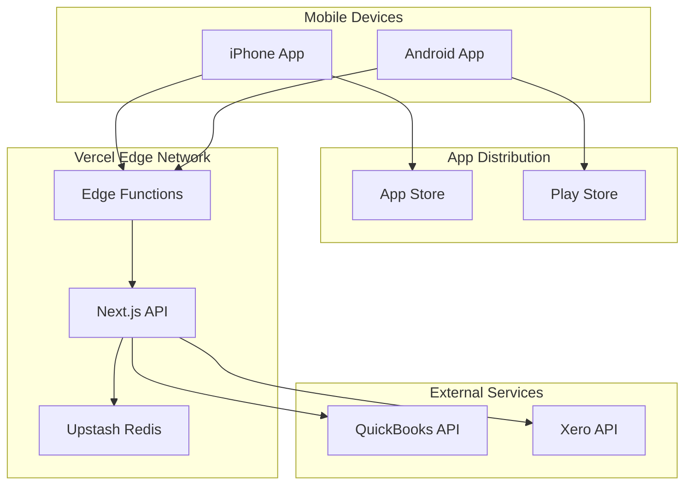

# Deployment Architecture

```poml
DOCUMENT_METADATA:
  type: "deployment_specification"
  purpose: "Production deployment architecture for Receipt Organizer MVP"
  scope: "Mobile app distribution and API deployment"
  last_updated: "2025-01-10"
  status: "Implemented"
```

## Deployment Overview

```poml
DEPLOYMENT_STRATEGY:
  mobile_apps:
    approach: "Native app store distribution"
    platforms: ["iOS App Store", "Google Play Store"]
    update_mechanism: "Store-managed updates"
    
  api_services:
    approach: "Serverless edge deployment"
    platform: "Vercel"
    region: "Global edge network"
    
  data_residency:
    approach: "On-device only"
    cloud_data: "OAuth tokens only (encrypted)"
    user_data: "Never leaves device"
```

## Mobile Application Deployment

### iOS Deployment

```yaml
Platform: iOS App Store
Target: iPhone iOS 12+

Build Pipeline:
  1. Flutter Build:
     - Command: flutter build ios --release
     - Output: Runner.app bundle
     - Signing: Automatic with Xcode
  
  2. Archive Creation:
     - Tool: Xcode Archive
     - Profile: Distribution provisioning
     - Certificates: Apple Developer account
  
  3. App Store Connect:
     - Upload: Via Xcode or Transporter
     - Review: Standard Apple review process
     - Distribution: Phased rollout available

Environment Configuration:
  - Production API URL
  - OAuth redirect URLs
  - Analytics keys (if enabled)
  - Crash reporting (Sentry)
```

### Android Deployment

```yaml
Platform: Google Play Store
Target: Android API 21+ (5.0 Lollipop)

Build Pipeline:
  1. Flutter Build:
     - Command: flutter build appbundle --release
     - Output: app-release.aab
     - Signing: Release keystore
  
  2. Bundle Optimization:
     - Format: Android App Bundle (AAB)
     - APK generation: Dynamic by Play Store
     - Size optimization: Per-device configuration
  
  3. Play Console:
     - Upload: Via Play Console or API
     - Testing: Internal/Beta tracks
     - Rollout: Staged percentage rollout

Environment Configuration:
  - Production API URL
  - OAuth redirect schemes
  - ProGuard rules for optimization
  - Permissions manifest
```

## API Deployment Architecture

### Vercel Deployment

```yaml
Platform: Vercel
Framework: Next.js 15.5.2
Runtime: Node.js Edge Runtime

Deployment Configuration:
  Build:
    - Command: npm run build
    - Output: .next directory
    - Environment: Production
  
  Infrastructure:
    - Type: Serverless Functions
    - Regions: Global Edge Network
    - Scaling: Automatic
    - Cold starts: ~50ms

API Endpoints:
  /api/oauth/quickbooks:
    - Purpose: QuickBooks OAuth flow
    - Method: GET, POST
    - Rate limit: 100/hour per IP
  
  /api/oauth/xero:
    - Purpose: Xero OAuth flow
    - Method: GET, POST
    - Rate limit: 100/hour per IP
  
  /api/validate/csv:
    - Purpose: CSV format validation
    - Method: POST
    - Rate limit: 1000/hour per IP
  
  /api/export/receipt:
    - Purpose: Direct API export
    - Method: POST
    - Rate limit: 500/hour per token
```

### Environment Variables

```bash
# Vercel Environment Variables (Encrypted)
QUICKBOOKS_CLIENT_ID=xxx
QUICKBOOKS_TOKEN=xxx
QUICKBOOKS_REDIRECT_URI=xxx

XERO_CLIENT_ID=xxx
XERO_TOKEN=xxx
XERO_REDIRECT_URI=xxx

JWT_TOKEN=xxx
ENCRYPTION_KEY=xxx

UPSTASH_REDIS_REST_URL=xxx
UPSTASH_REDIS_REST_TOKEN=xxx

SENTRY_DSN=xxx (optional)
```

## Infrastructure Architecture



## Deployment Environments

### Development

```yaml
Mobile:
  - Flutter debug build
  - Local API endpoint
  - Mock OAuth flow
  - Console logging enabled

API:
  - Local Next.js dev server
  - Port: 3001
  - Hot reload enabled
  - Verbose logging
```

### Staging

```yaml
Mobile:
  - Release build with debug symbols
  - Staging API endpoint
  - TestFlight (iOS) / Internal track (Android)
  - Remote debugging enabled

API:
  - Vercel preview deployment
  - Branch-based deploys
  - Staging environment variables
  - Performance monitoring
```

### Production

```yaml
Mobile:
  - Release build, optimized
  - Production API endpoint
  - App Store / Play Store
  - Crash reporting only

API:
  - Vercel production deployment
  - Global edge distribution
  - Production secrets
  - Rate limiting enforced
```

## CI/CD Pipeline

### Mobile CI/CD

```yaml
Trigger: Tag push (v*)

Pipeline:
  1. Test:
     - Unit tests
     - Widget tests
     - Integration tests
  
  2. Build:
     - iOS: GitHub Actions macOS runner
     - Android: GitHub Actions Ubuntu runner
  
  3. Deploy:
     - iOS: fastlane to TestFlight
     - Android: fastlane to Play Console
  
  4. Release:
     - Manual approval required
     - Phased rollout recommended
```

### API CI/CD

```yaml
Trigger: Push to main branch

Pipeline:
  1. Test:
     - npm test
     - Type checking
     - Linting
  
  2. Preview:
     - Automatic Vercel preview
     - PR comment with URL
  
  3. Production:
     - Merge to main
     - Automatic Vercel deploy
     - Zero-downtime deployment
```

## Monitoring & Observability

### Application Monitoring

```yaml
Mobile Metrics:
  - Crash-free rate (Target: >99.5%)
  - App launch time
  - OCR processing time
  - Memory usage
  - Battery impact

API Metrics:
  - Response time (p95 <200ms)
  - Error rate (<0.1%)
  - OAuth success rate
  - Rate limit violations
  - Cold start frequency
```

### Error Tracking

```yaml
Sentry Integration:
  Mobile:
    - Crash reports
    - ANR detection
    - Performance traces
    - User feedback
  
  API:
    - Exception tracking
    - Performance monitoring
    - Custom error boundaries
    - Release tracking
```

## Security Considerations

### Mobile Security

```yaml
Data Protection:
  - SQLite encryption at rest
  - Keychain/Keystore for secrets
  - No sensitive data in logs
  - Certificate pinning for API

Code Protection:
  - ProGuard (Android)
  - Symbol stripping (iOS)
  - Anti-tampering checks
  - Obfuscation
```

### API Security

```yaml
Authentication:
  - JWT tokens (short-lived)
  - Refresh token rotation
  - OAuth state validation
  - PKCE for OAuth flows

Rate Limiting:
  - Per-IP limits via Upstash
  - Per-token limits
  - Gradual backoff
  - DDoS protection (Vercel)

Data Security:
  - TLS 1.3 only
  - No sensitive data logging
  - Encrypted environment variables
  - Security headers (CSP, HSTS)
```

## Rollback Procedures

### Mobile Rollback

```yaml
iOS:
  - Cannot rollback published versions
  - Expedited review for critical fixes
  - Phased rollout pause option

Android:
  - Cannot rollback to users
  - Staged rollout halt option
  - Previous APK reactivation possible
```

### API Rollback

```yaml
Vercel:
  - Instant rollback to previous deployment
  - Git revert triggers redeploy
  - Environment variable rollback
  - Zero downtime rollback
```

## Cost Optimization

```yaml
Vercel (API):
  - Free tier: 100GB bandwidth
  - Optimization: Edge caching
  - Monitoring: Usage dashboard

Upstash Redis:
  - Pay-per-request model
  - Optimization: Efficient key design
  - Monitoring: Request metrics

App Stores:
  - Apple: $99/year developer account
  - Google: $25 one-time fee
  - No per-install costs
```

## Disaster Recovery

```yaml
Mobile App:
  - Source code in Git
  - Signing certificates backed up
  - Build configurations documented
  - Recovery time: <4 hours

API:
  - Infrastructure as code
  - Environment variables documented
  - Automatic Vercel backups
  - Recovery time: <5 minutes

Data:
  - User data on-device only
  - No cloud backup needed
  - OAuth tokens regeneratable
```

---
*Last Updated: January 10, 2025*  
*Next Review: After first production deployment*