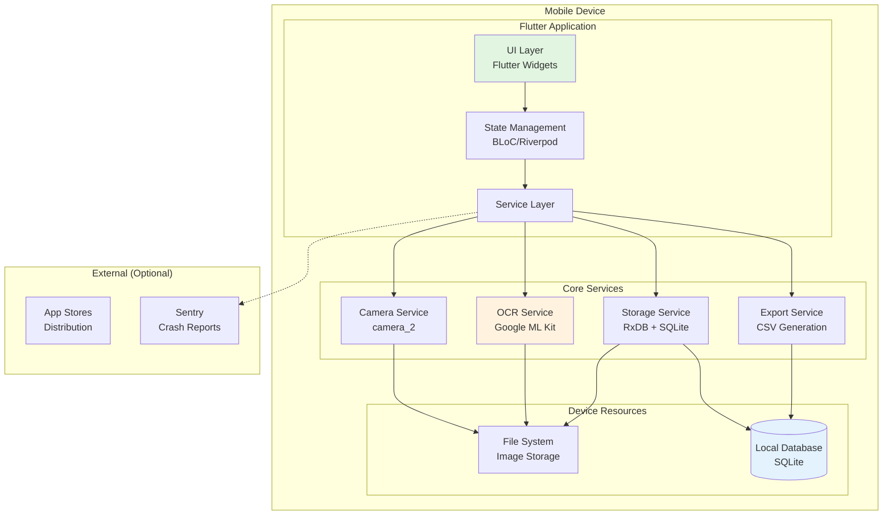

# High Level Architecture

```poml
SECTION_METADATA:
  type: "architecture_overview"
  section_number: 2
  focus: "System design and platform decisions"
  key_decisions: ["mobile_first", "offline_first", "minimal_infrastructure"]

ARCHITECTURE_SUMMARY:
  approach: "mobile-first, offline-first"
  primary_framework: "Flutter 3.24+"
  processing_model: "on-device"
  performance_target: "<5s capture-to-extract"
  connectivity: "complete offline functionality"
  infrastructure: "minimal MVP deployment"
```

## 2.1 Technical Summary

The Receipt Organizer MVP employs a **mobile-first, offline-first architecture** using Flutter 3.24+ for cross-platform development, with all processing occurring on-device through Google ML Kit for OCR and RxDB for reactive local storage. The architecture prioritizes immediate responsiveness through local processing, achieving <5s capture-to-extract performance while maintaining complete functionality without network connectivity. Infrastructure is minimal in MVP, consisting of app store distribution and optional crash reporting, with the architecture designed to progressively enhance with cloud features post-launch. This approach directly supports the PRD goals of honest OCR transparency, offline reliability, and guaranteed CSV export compatibility for SMB accounting workflows.

## 2.2 Platform and Infrastructure Choice

```poml
PLATFORM_SELECTION:
  selected: "Local-Only Mobile"
  key_services:
    - service: "Google ML Kit"
      purpose: "on-device text recognition"
      rationale: "Best mobile OCR accuracy without network dependency"
    - service: "RxDB with SQLite adapter"
      purpose: "offline-first reactive database"
      rationale: "Reactive updates with guaranteed offline capability"
    - service: "Local file system"
      purpose: "compressed image storage"
      rationale: "Direct device access, no cloud dependencies"
    - service: "Sentry (optional)"
      purpose: "crash reporting"
      rationale: "Minimal monitoring for MVP, privacy-compliant"

DEPLOYMENT_STRATEGY:
  ios:
    platform: "Apple App Store"
    distribution: "Global"
    build_target: "iOS 13.0+"
  android:
    platform: "Google Play Store"
    distribution: "Global"
    build_target: "API 21+"
  server_infrastructure: "None in MVP"
```

**Selected Platform:** Local-Only Mobile  
**Key Services:** 
- Google ML Kit (on-device text recognition)
- RxDB with SQLite adapter (offline-first reactive database)
- Local file system (compressed image storage)
- Optional: Sentry for crash reporting

**Deployment Host and Regions:** 
- iOS: Apple App Store (Global)
- Android: Google Play Store (Global)
- No server infrastructure in MVP

## 2.3 Repository Structure

```poml
REPOSITORY_ARCHITECTURE:
  structure: "Monorepo with clear package boundaries"
  tool: "Flutter workspace with shared packages"
  organization_principle: "Feature-based separation with shared core"
  
PACKAGE_ORGANIZATION:
  apps:
    mobile: "Flutter mobile application"
  packages:
    core: "Business logic, models, OCR services"
    ui: "Reusable UI components"
    data: "RxDB schemas, storage services"
  tools:
    purpose: "Build scripts, CSV validators"
```

**Structure:** Monorepo with clear package boundaries  
**Monorepo Tool:** Flutter workspace with shared packages  
**Package Organization:**
```
receipt_organizer/
├── apps/
│   └── mobile/          # Flutter mobile application
├── packages/
│   ├── core/           # Business logic, models, OCR services
│   ├── ui/             # Reusable UI components
│   └── data/           # RxDB schemas, storage services
└── tools/              # Build scripts, CSV validators
```

## 2.4 High Level Architecture Diagram

```poml
SYSTEM_ARCHITECTURE:
  layers:
    presentation: ["UI Layer", "Flutter Widgets"]
    business: ["State Management", "BLoC/Riverpod"]
    service: ["Service Layer"]
    core: ["Camera Service", "OCR Service", "Storage Service", "Export Service"]
    data: ["File System", "Local Database"]
  external:
    distribution: ["App Stores"]
    monitoring: ["Sentry (optional)"]
```



## 2.5 Architectural Patterns

```poml
ARCHITECTURAL_PATTERNS:
  clean_architecture:
    description: "Separation of UI, domain, and data layers for testability and maintainability"
    rationale: "Enables easy testing and future platform expansion"
  offline_first:
    description: "All operations work locally with optional sync"
    rationale: "Core requirement for SMB users with unreliable connectivity"
  repository_pattern:
    description: "Abstract data access through repository interfaces"
    rationale: "Allows swapping storage implementations without affecting business logic"
  bloc_pattern:
    description: "Reactive state management with streams"
    rationale: "Flutter-native pattern for predictable state updates and testability"
  command_pattern:
    description: "Encapsulate all user actions as commands"
    rationale: "Enables undo/redo and action logging for debugging"
  factory_pattern:
    description: "OCR engine creation with fallback strategies"
    rationale: "Graceful degradation when primary OCR fails"
  observer_pattern:
    description: "RxDB reactive queries for real-time UI updates"
    rationale: "Automatic UI refresh when data changes"
  facade_pattern:
    description: "Simplified interface for complex OCR operations"
    rationale: "Hide ML Kit complexity from business logic"
```

- **Clean Architecture:** Separation of UI, domain, and data layers for testability and maintainability - *Rationale:* Enables easy testing and future platform expansion
- **Offline-First Pattern:** All operations work locally with optional sync - *Rationale:* Core requirement for SMB users with unreliable connectivity
- **Repository Pattern:** Abstract data access through repository interfaces - *Rationale:* Allows swapping storage implementations without affecting business logic
- **BLoC Pattern (or Riverpod):** Reactive state management with streams - *Rationale:* Flutter-native pattern for predictable state updates and testability
- **Command Pattern:** Encapsulate all user actions as commands - *Rationale:* Enables undo/redo and action logging for debugging
- **Factory Pattern:** OCR engine creation with fallback strategies - *Rationale:* Graceful degradation when primary OCR fails
- **Observer Pattern:** RxDB reactive queries for real-time UI updates - *Rationale:* Automatic UI refresh when data changes
- **Facade Pattern:** Simplified interface for complex OCR operations - *Rationale:* Hide ML Kit complexity from business logic